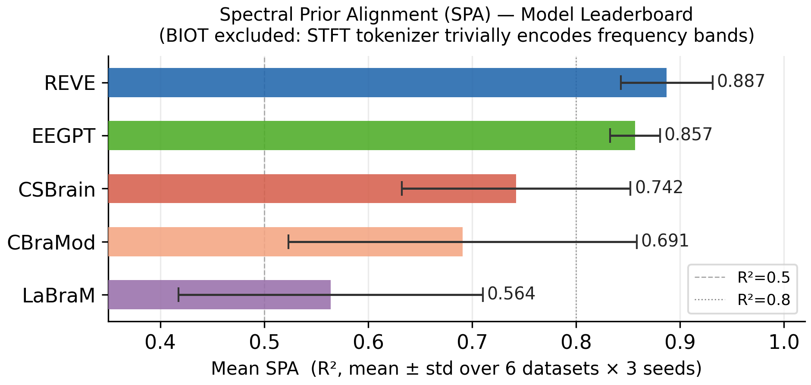
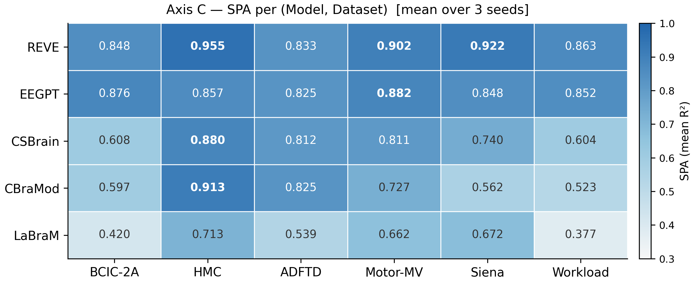
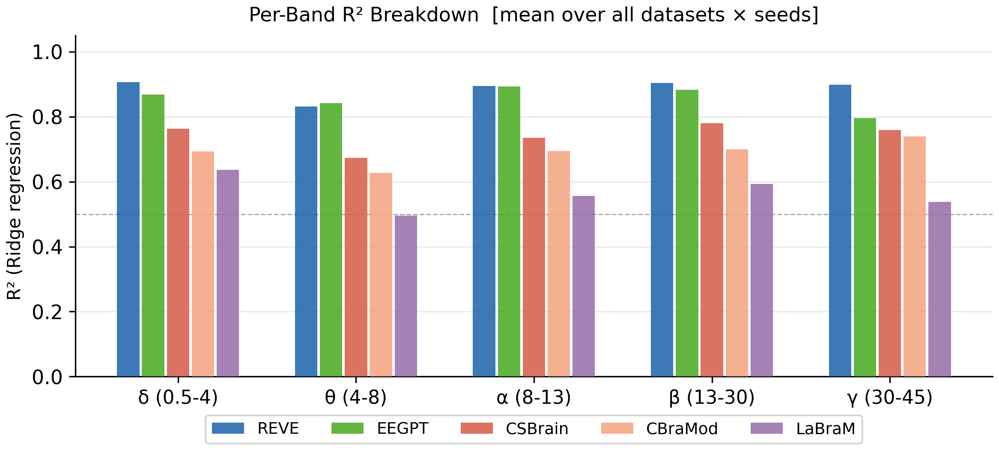
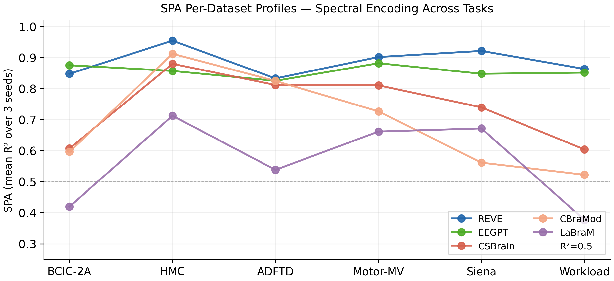
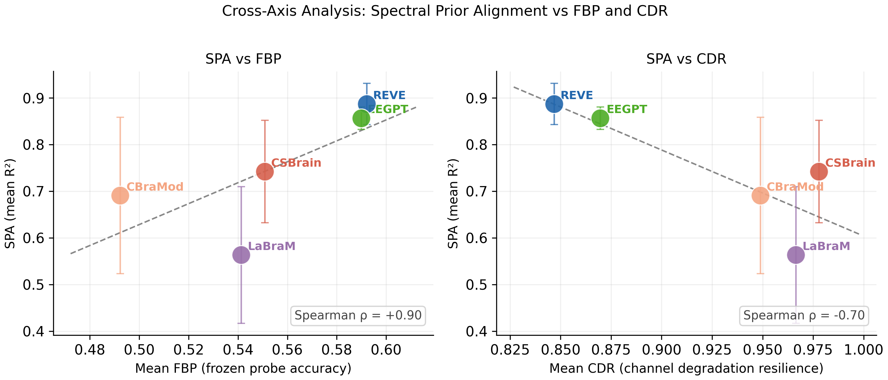

# UniformEvalBench

**A Multi-Axis Benchmark for Evaluating EEG Foundation Models on Representation Quality, Robustness, and Neurophysiological Grounding**

---

## Table of Contents

1. [Abstract](#1-abstract)
2. [Introduction](#2-introduction)
3. [Related Work](#3-related-work)
4. [Benchmark Design Principles](#4-benchmark-design-principles)
5. [Finalized Model Pool](#5-finalized-model-pool)
6. [Finalized Dataset Pool](#6-finalized-dataset-pool)
7. [Axis A — Representation Quality](#7-axis-a--representation-quality)
8. [Axis B — Robustness](#8-axis-b--robustness)
9. [Axis C — Spectral Prior Alignment](#9-axis-c--spectral-prior-alignment)
10. [Composite Ranking: UEB-General](#10-composite-ranking-ueb-general)
11. [Statistical Framework](#11-statistical-framework)
12. [Pre-Registered Claims](#12-pre-registered-claims)
13. [Fallback Narratives](#13-fallback-narratives)
14. [Risk Register](#14-risk-register)
15. [Limitations](#15-limitations)
16. [Conclusion](#16-conclusion)
17. [Appendix A — Summary of Changes from Blueprint v0](#appendix-a--summary-of-changes-from-blueprint-v0)

---

## 1. Abstract

Current EEG Foundation Model (EEG-FM) leaderboards conflate representation quality, downstream plasticity, and architecture-specific fine-tuning behavior. A model can rank first on a fine-tuning leaderboard by having a large, easily reorganized task head rather than strong frozen representations — and no existing benchmark separates these contributions.

We introduce **UniformEvalBench**, a multi-axis benchmark that evaluates EEG-FMs along three primary axes: training-free frozen representation quality (Axis A: kNN@20), CDR (Channel Degradation Resilience) under realistic signal degradation (Axis B: chance-corrected balanced accuracy under test-only channel dropout), and spectral prior alignment (Axis C: Ridge regression R² over the five canonical EEG frequency bands). We demonstrate that these axes induce systematically different model rankings: the model with the highest kNN@20 (EEGPT) does not lead on CDR; the most spectrally grounded model (REVE) degrades the most under channel loss. A composite leaderboard — **UEB-General** — uses a geometric mean over Axis A and B scores to prevent single-axis dominance.

Axes are evaluated on 6 EEG-FMs + 1 general-purpose reference across 7 heterogeneous datasets spanning motor imagery, sleep staging, neurodegenerative diagnosis, seizure detection, cognitive workload, and clinical epilepsy discrimination. We additionally contribute **Epilepsy Mimickers**, a new 80-subject clinical EEG dataset for distinguishing true epilepsy from non-epileptic conditions that present identically to the clinician, and release an adapter-based benchmark harness (ModelAdapter ABC) that allows any external EEG-FM to be evaluated without modifying benchmark internals.

---

## 2. Introduction

### 2.1 The Evaluation Problem

EEG-FMs — BENDR, BIOT, LaBraM, EEGPT, CBraMod, CSBrain, REVE, and others — are typically evaluated by fine-tuning on downstream datasets and reporting balanced accuracy, AUROC, or F1. This practice has three limitations that have not been systematically addressed for EEG:

1. **Full fine-tuning obscures pretraining quality.** A sufficiently expressive task head trained for enough epochs can achieve strong performance even on top of a mediocre backbone. Fine-tuning accuracy is therefore a joint measurement of representation quality and downstream plasticity — it cannot attribute performance to either component.
2. **Clean-data accuracy overestimates deployment reliability.** Curated EEG benchmarks apply heavy preprocessing (ICA, bandpass filtering, rejection of contaminated trials). Deployed systems see raw signal with electrode failures, motion artifacts, and non-stationary noise. A model that is accurate on clean data may collapse under realistic degradation.
3. **Accuracy does not imply scientific validity.** A model that exploits task-confounded EMG bleedthrough in motor imagery data can achieve high accuracy without encoding neurophysiologically plausible features. For clinical and scientific applications, this distinction matters.

EEG-FM-Bench (Xiong et al., 2026) documented these issues with diagnostic analyses — gradient conflict metrics, CKA, RSA, scaling law deviations — but retained full fine-tuning as the primary evaluation mode. UniformEvalBench proposes a complementary evaluation framework that measures these properties directly and pre-registers the claims it makes.

### 2.2 Contributions

1. **A hyperparameter-free primary metric (kNN@20) for frozen-encoder quality.** kNN@20 has exactly one hyperparameter ($k$, a count), learns nothing, and directly asks whether same-class samples cluster in embedding space — the same evaluation strategy as DINOv2 (Oquab et al., 2023). Rankings cannot be attributed to probe design choices. We additionally define formally grounded adaptation metrics — AdaptGap and NormAdaptGain — to quantify the representation-to-downstream mismatch between frozen probing and full fine-tuning.
2. **A robustness evaluation protocol grounded in realistic EEG signal degradation** — pre-adapter channel dropout (simulating electrode failure) and physiological artifact injection at calibrated SNR levels using 1/f noise and real EOG/EMG templates.
3. **A prior-free neurophysiological grounding metric (SPA)** that measures whether frozen EEG-FM embeddings linearly encode the five canonical spectral bands (δ/θ/α/β/γ). SPA requires no contested spatial priors; empirically, spectral encoding is strongly associated with downstream accuracy — LaBraM's θ-band R² deficit (0.496 vs pool median ≈0.67) mechanistically explains its near-chance performance on cognitive tasks. A complementary electrode-attribution metric (NAS) for motor imagery tasks is provided in Supplement B.
4. **A pre-registered statistical framework** that separates confirmatory from exploratory tests and provides fallback narratives so the paper is publishable under multiple empirical outcomes.

### 2.3 Scope

This draft formalizes the benchmark methodology. It does not report experimental results. The companion experimental paper tests the four pre-registered claims in Section 12.

---

## 3. Related Work

**MOABB** (Jayaram & Barachant, 2018) standardizes BCI decoding evaluation for classical methods but predates foundation models and does not address representation quality or physiological grounding.

**BEETL** (Wei et al., 2022) targets transfer learning with cross-subject and cross-dataset splits but focuses on motor imagery and does not evaluate pretrained representations in the frozen-backbone regime.

**AdaBrain-Bench** (Chen et al., 2025) evaluates adaptation methods (LoRA, adapters, full FT) across EEG-FMs but does not separately measure representation quality, robustness, or physiological grounding.

**EEG-FM-Bench** (Xiong et al., 2026) provides the most comprehensive diagnostic analysis of EEG-FMs to date: multi-task training with gradient conflict metrics, CKA/RSA representation comparisons, scaling law analyses. Its primary evaluation metric remains full fine-tuning balanced accuracy. UniformEvalBench validates selected reference adapters against the same model implementations and uses EEG-FM-Bench findings as motivating evidence, but provides an independent adapter-based evaluation harness: the benchmark interface (`ModelAdapter` ABC, `DatasetAdapter`, `UEBTrainer`) does not depend on EEG-FM-Bench internals and any external EEG-FM can be evaluated by implementing three methods.

**Table 1 — Benchmark Comparison**

| Benchmark | FBP Ranking | Robustness | Neuro Grounding | Pre-Reg. | EEG-Specific |
|-----------|:---:|:---:|:---:|:---:|:---:|
| MOABB | – | – | – | – | Yes |
| BEETL | – | – | – | – | Yes |
| AdaBrain-Bench | – | – | – | – | Yes |
| EEG-FM-Bench | Partial | – | – | – | Yes |
| **UniformEvalBench** | **Yes** | **Yes** | **Yes** | **Yes** | **Yes** |

---

## 4. Benchmark Design Principles

Four principles govern the design:

1. **Separation of concerns.** Each axis measures a distinct property. If two axes are perfectly correlated across the model pool, one of them is redundant.
2. **Realistic degradation.** Robustness is measured under conditions that resemble deployment — electrode failure, physiological artifacts with appropriate spectral shape — not Gaussian noise.
3. **Validity checks on novel metrics.** Any metric proposed for the first time in this work (most prominently SPA) must pass an empirical validity check against an independent outcome. A metric that does not predict anything is not a contribution — it is a description.

---

## 5. Finalized Model Pool

The benchmark evaluates **6 EEG Foundation Models** (the core evaluation group) plus **MOMENT** as a general time-series FM reference (to test whether EEG-specific pretraining provides measurable benefit). Two additional models — BENDR and Mantis — have adapter implementations pending and are not included in the current experimental results.

### 5.1 Core EEG Foundation Models (Group A, n=6, evaluated)

Each model is integrated via a `ModelAdapter` subclass — a three-method interface (`encode`, `freeze_encoder`, `unfreeze_encoder`) that wraps model-specific weight loading and forward pass. The benchmark evaluation harness (axes A, B, C) calls only `ModelAdapter` methods; it does not depend on any model-specific internals.

| # | Model | Architecture | Adapter | Key Properties |
|---|-------|--------------|---------|----------------|
| M1 | **BIOT** | Transformer with per-channel STFT patch embedding | `BIOTAdapter` | Widely cited biosignal transformer (Yang et al., 2023); STFT tokenizer |
| M2 | **LaBraM** | Channel-wise NeuralTransformer with TemporalConv | `LaBraMAdapter` | VQ-VAE tokenization (Jiang et al., 2024) |
| M3 | **EEGPT** | ViT-style patch transformer, dynamic channels | `EEGPTAdapter` | Strong frozen-probe performance (Wang et al., 2024) |
| M4 | **CBraMod** | Patch embedding + criss-cross attention | `CBraMoDAdapter` | Recent; interleaved spatial-temporal attention (Wang et al., 2024) |
| M5 | **CSBrain** | Transformer with TemEmbedEEGLayer + region attention | `CSBrainAdapter` | Region-aware architecture |
| M6 | **REVE** | 22-depth transformer with GEGLU FFN, 4D Fourier PE | `REVEAdapter` | Deep + Fourier positional encoding |

### 5.2 General Time-Series FM Reference (Group B, n=1, evaluated)

MOMENT serves as a non-EEG reference: if a general TS-FM matches EEG-specific models, EEG-specific pretraining provides no measurable benefit on that axis.

| # | Model | Architecture | Note |
|---|-------|--------------|------|
| M7 | **MOMENT** | T5-encoder time-series FM | `MOMENTAdapter` (partial: OOM on long-segment datasets) |

### 5.3 Adapter-Pending Models (not included in current results)

| # | Model | Status |
|---|-------|--------|
| M8 | **BENDR** | `BENDRAdapter` implementation pending |
| M9 | **Mantis** | `MantisAdapter` implementation pending |

These models will be added to the leaderboard once their adapters pass the adapter conformance test suite (`tests/test_adapter_conformance.py`).

### 5.4 Pretrained Weights

| Model | Source | Location |
|-------|--------|----------|
| BIOT | Authors' release | `assets/checkpoints/biot/` |
| LaBraM | HuggingFace or authors | `assets/checkpoints/labram/` |
| EEGPT | Wang et al. release | `assets/checkpoints/eegpt/` |
| CBraMod | HuggingFace | `assets/checkpoints/cbramod/` |
| CSBrain | Authors' release | `assets/checkpoints/csbrain/` |
| REVE | Authors' release (+ `pos_bank_pretrained_path`) | `assets/checkpoints/reve/` |
| MOMENT | HuggingFace `AutonLab/MOMENT` (auto-download) | auto |

### 5.5 Model Uniformity

To ensure cross-model comparability:
- All models expose a **pooled feature vector** via a consistent extraction hook at the output of their final encoder block.
- For models without a native CLS token (BENDR, EEGPT, CBraMod, CSBrain, REVE), features are mean-pooled over patches.
- For BIOT and LaBraM (which use model-specific tokens), the CLS / `[CLS]`-equivalent token is extracted.
- Feature dimensionality varies across models; L2-normalization is applied before passing features to probes to reduce scale-induced bias.

---

## 6. Finalized Dataset Pool

The benchmark uses **7 datasets** chosen to span major EEG paradigms, to provide both subject-dependent and subject-independent evaluation regimes, and to include both small-subject and large-subject scenarios. D7 (Epilepsy Mimickers) is a novel public dataset contributed by this benchmark. All are implemented via `DatasetAdapter` subclasses under `uniformevalbench/adapters/`.

### 6.1 Dataset Summary

| # | Dataset | Key | Paradigm | Classes | Subjects | Duration | Role |
|---|---------|-----|----------|---------|----------|----------|------|
| D1 | **BCIC-IV-2a** | `bcic_2a` | Motor Imagery | 4 (left/right/foot/tongue) | 9 | ~4 s/trial | Standard BCI benchmark; strong inter-subject variability |
| D2 | **HMC** | `hmc` | Sleep Staging | 5 (W/N1/N2/N3/REM) | ~151 recs | 30 s epochs | Largest intra-dataset subject diversity; imbalanced classes |
| D3 | **ADFTD** | `adftd` | Neurodegenerative Diagnosis | 3 (AD/FTD/CN) | 88 | 10 s epochs | Cohort-style diagnosis; clinically meaningful |
| D4 | **Motor-MV-Img** | `motor_mv_img` | Multi-view Motor Imagery | 4 (left/right/foot/tongue) | — | ~4 s/trial | Exercises cross-view generalization of motor representations |
| D5 | **Siena Scalp EEG** | `siena_scalp` | Seizure Detection | 2 (ictal/non-ictal) | ~14 | variable | Imbalanced binary clinical; tests seizure detection under dropout |
| D6 | **Workload** | `workload` | Cognitive Workload | 2 (high/low) | — | variable | Tests whether FMs encode cognitive state from frontal theta |
| D7 | **Epilepsy Mimickers** | `epilepsy_mimickers` | Clinical Binary | 2 (Epileptic/Mimicker) | 80 | 10 s epochs | **Novel public dataset** contributed by this benchmark; tests discrimination of epilepsy from non-epileptic mimics |

### 6.1.1 Dataset D7: Epilepsy Mimickers (novel contribution)

"Epilepsy mimickers" are non-epileptic conditions — syncope, non-epileptic attack disorder (NEAD), metabolic encephalopathy, and others — that produce clinical presentations indistinguishable from epilepsy by history alone. Accurate EEG-based discrimination between true epilepsy and mimickers matters: misclassifying a mimicker as epileptic leads to years of unnecessary anti-epileptic drug treatment; misclassifying epilepsy as a mimicker delays protective treatment.

The dataset contains **80 subjects recorded with a standard 19-channel 10-20 montage at 125 Hz** with a linked-ear reference: 50 confirmed epilepsy cases (Epileptic, `E001–E050`) and 30 subjects with confirmed non-epileptic conditions (Mimickers, `M001–M030`). Recordings are routine diagnostic EEGs of variable length; each is segmented into non-overlapping **10-second epochs** and assigned the whole-recording binary label. The class imbalance ratio is 5:3 (Epileptic:Mimickers).

**Splits** are deterministic and subject-level: the last five epileptic subjects (E046–E050) and last three mimicker subjects (M028–M030) form the held-out test set (8 subjects); the preceding five epileptic (E041–E045) and three mimicker (M025–M027) subjects form the validation set (8 subjects); the remaining 64 subjects form the training set.

**Public release**: this dataset is released publicly alongside the benchmark as a new EEG clinical classification resource. MOMENT is excluded from D7 experiments owing to memory constraints.

**Statistical note on the held-out test set.** The deterministic split (8 test subjects) is used for the public leaderboard. Because only 8 subjects are statistically independent at the subject level, the paper additionally reports repeated 5-fold stratified subject-level cross-validation as a sensitivity analysis. This prevents the reviewer objection that epoch-level sample size (several thousand) overstates the effective sample size when subjects are the true independent unit.

### 6.2 Why These Datasets

- **Paradigm diversity**: motor imagery (D1, D4), sleep staging (D2), neurodegenerative diagnosis (D3), seizure detection (D5, D7), cognitive workload (D6). Seven paradigms, zero redundancy.
- **Channel diversity**: 19 channels (D7) to 64+ (D2). Exercises model adaptability to montage variation.
- **Class-count diversity**: binary (D5, D6, D7) through 5-class sleep staging (D2).
- **Temporal structure diversity**: 4-second motor trials (D1, D4), 30-second sleep epochs (D2), variable-length clinical recordings (D5, D7).
- **Overlap with prior work**: D1 and D2 appear in EEG-FM-Bench, enabling direct comparison on those datasets.

### 6.2.1 Datasets Not in Current Scope

The following datasets are excluded from the current experimental pool but may be added as supplementary or in future iterations: SEED-IV (emotion recognition; paradigm not covered by current model pool strengths), TUAB (EEG abnormality detection; requires large-scale preprocessing not yet harmonized), TUEV (clinical event classification; 6-class, implementation pending).

### 6.3 Datasets Excluded and Why

- **SEED, SEED-IV, SEED-FRA, SEED-GER, SEED-V, SEED-VII**: emotion recognition; not currently in the experimental pool (see §6.2.1). SEED-IV may be added in future iterations.
- **TUAB, TUEV, TUAR, TUEP, TUSL, TUSZ**: TUH clinical subsets; not currently in the experimental pool (see §6.2.1). May be added as supplementary with harmonized preprocessing.
- **BrainLat**: large (780 subjects) but newer and less standardized; deferred to v0.2.
- **HBN**: valuable but heterogeneous in label definitions; deferred.
- **Inner Speech, ChiSCo, OpenMIIR, ThingsEEG(-2)**: specialized paradigms; out of scope for the core six.

### 6.4 Preprocessing Harmonization

To enable cross-dataset aggregation, all datasets are normalized to a common format:

- **Sampling rate**: resampled to **200 Hz** (native rate for several datasets; linear interpolation applied where native rate differs).
- **Band-pass filter**: 0.5–75 Hz (Butterworth, zero-phase).
- **Notch filter**: 50/60 Hz depending on recording region.
- **Referencing**: common average reference.
- **Channel montage**: mapped to a superset of standard 10-20 electrode positions. Missing channels are zero-filled at the model input stage (pre-adapter).
- **Trial duration — paradigm-specific, not globally harmonized**. Forcing a single window length across paradigms breaks paradigm-defining signal structures (e.g., slow waves and spindles in sleep staging span 0.5–3 s events inside the canonical 30-s epoch and cannot be captured in shorter windows). We therefore preserve the native scoring unit per paradigm:
  - Motor imagery (D1, D4): **4 s** (standard BCI-IV-2a cue-to-end window).
  - Sleep staging (D2): **30 s epochs — non-negotiable**, matching AASM scoring convention.
  - Neurodegenerative diagnosis (D3): **10 s** non-overlapping windows.
  - Seizure detection (D5): variable (whole-recording segments, segmented to 10 s).
  - Cognitive workload (D6): variable (task-block segments, segmented to trial length).
  - Clinical binary novel (D7): **10 s** non-overlapping windows (whole-recording label per subject).

  Any model that cannot accept an input longer than some threshold is explicitly excluded from that paradigm rather than being forced through a truncated window. Exclusions are logged in the results table, not silently accommodated.

### 6.5 Splitting Protocol

- **D1 (BCIC-IV-2a)**: subject-dependent split (within-subject train/test per the original challenge protocol) AND leave-one-subject-out. Both regimes are reported.
- **D2 (HMC)**: subject-independent split (80/20 by recording ID, stratified by demographics).
- **D3 (ADFTD)**: subject-level 5-fold cross-validation stratified by diagnostic label.
- **D4 (Motor-MV-Img)**: subject-dependent split per source dataset protocol.
- **D5 (Siena Scalp)**: subject-level leave-one-out (14 subjects); subject-level leakage explicitly verified.
- **D6 (Workload)**: subject-dependent split per source dataset protocol.
- **D7 (Epilepsy Mimickers)**: deterministic subject-level split — E046–E050 + M028–M030 = test (8 subjects), E041–E045 + M025–M027 = valid (8 subjects), remaining 64 subjects = train.

All splits for cross-subject evaluation (Axis A cross-subject FBP) use leave-one-subject-out where subject counts are ≤30 and k-fold (k=10) where subject counts are >30.

---

## 7. Axis A — Representation Quality

### 7.1 Probing Hierarchy

For each model $m$ and task $t$, we evaluate four adaptation regimes, listed here from least to most parametric:

- **k-NN probe (primary metric, $k=20$, cosine distance)**: the encoder is frozen; no parameters are learned. For each test sample, the $k$ nearest training-set embeddings (by cosine similarity) vote on the class; balanced accuracy over the test split is reported. We sweep $k \in \{5, 10, 20, 50\}$ and report $k=20$ as the primary value. The k-sensitivity (max $-$ min balanced acc across $k$) is reported separately to show the single hyperparameter does not materially affect rankings. Features are L2-normalised before the kNN search; L2 normalisation converts cosine similarity to Euclidean distance, allowing exact search without approximate methods. See §7.3 for the full argument for why kNN@20 is primary.
- **Frozen-backbone probe (FBP)**: the encoder is frozen (`freeze_encoder=True`), and a small classifier head is trained end-to-end on top of its pooled patch features. Head architecture: average-pool across patches → Linear($d \to 128$) → ReLU → Dropout(0.3) → Linear($128 \to n_\text{classes}$). Training: AdamW with head LR = 5 × 10⁻⁴, 30 epochs, label smoothing 0.1, gradient clip 3.0. Matches EEG-FM-Bench's "Frozen" evaluation mode (same trainer code, same head, same schedule). Reported as a secondary metric and validated against kNN@20 via Kendall $\tau$ (see §7.3).
- **Linear probe (LP, single linear layer)**: pure textbook LP for completeness — single linear layer on average-pooled frozen features, no hidden unit. Planned as a supplementary probe; not yet run in this draft.
- **Full fine-tuning (FT)**: same head as FBP but `freeze_encoder=False`; encoder trained jointly with head at encoder LR = 0.1 × head LR. Matches each model's published training recipe as implemented in EEG-FM-Bench (per-model LR scheduler and optimizer hyperparameters are retained from the original authors' configs; see Section 7.1.1 for the exact per-model deviations).

All probes operate on the same pooled feature vector extracted from the backbone's final encoder layer (see Section 5.5). Features are L2-normalized before all probing steps.

### 7.1.1 Per-Model Training Recipes (FBP and FT)

All seven models share the following FT/FBP hyperparameters: AdamW optimizer, head LR 5 × 10⁻⁴, encoder LR 0.1 × head LR, 30 epochs, batch size 32, gradient clip 3.0, weight decay 0.01, label smoothing 0.1, bf16 AMP (except BIOT). Per-model deviations are dictated by each model's `validate_config` in the baseline codebase:

| Model | LR schedule | AMP | Notes |
|---|---|---|---|
| EEGPT | onecycle (pct_start=0.2) | bf16 | ViT-style patch transformer, 8 layers, 512 dim |
| LaBraM | cosine (2-epoch warmup) | bf16 | Channel-wise NeuralTransformer, VQ-NSP tokenizer |
| CBraMod | cosine | bf16 | Criss-cross attention, 12 layers |
| BIOT | cosine | **fp32** (cuFFT STFT forbids bf16) | Patch-frequency transformer, 4 layers |
| CSBrain | cosine | bf16 | Region-aware transformer, 12 layers |
| REVE | reduce_on_plateau | bf16 | 22-layer transformer, 4D Fourier PE |
| MOMENT | cosine | bf16 | T5-large encoder backbone, 24 layers |

This matches EEG-FM-Bench's "each model runs under its authors' recipe" convention. A single harmonized training recipe across all 7 models is a known alternative; we keep the authors' recipes because it lets our numbers be directly compared to published per-model results and because forcing models to use a non-native schedule can degrade them in ways that confound architectural comparisons. This trade-off is an acknowledged limitation (Section 15).

### 7.2 Adaptation Metrics

**AdaptGap** measures the absolute fine-tuning benefit over frozen-backbone probing:

$$
\text{AdaptGap}(m, t) = \text{FT}(m, t) - \text{FBP}(m, t)
$$

**NormAdaptGain** measures the fraction of remaining headroom captured by fine-tuning:

$$
\text{NormAdaptGain}(m, t) = \frac{\text{FT}(m, t) - \text{FBP}(m, t)}{1 - \text{FBP}(m, t)}
$$

NormAdaptGain has a natural range of $(-\infty, 1]$ and avoids the division-by-small-number instability of ratio-based metrics. The three regimes have clear interpretations:

- **Negative values** indicate fine-tuning *reduced* performance relative to the frozen representation — diagnostic of FT overfitting, optimizer instability, or a task head that disrupts good pretrained features.
- **Values near 0** indicate fine-tuning adds little beyond the frozen baseline — the representation is already near its effective ceiling for the downstream head.
- **Values near 1** indicate fine-tuning recovers most of the remaining headroom between FBP and perfect accuracy.

Negative NormAdaptGain is therefore not a metric failure but an informative signal: it flags (model, task) pairs where fine-tuning is a net harm, which is itself a finding. We report the full distribution rather than clipping or absolute-valuing.

**We do not apply a viability threshold.** All models are ranked on all tasks in the full leaderboard, and models with low FBP performance are reported as-is. If a model's FBP is near chance, its NormAdaptGain will naturally be high — which is informative: it signals that the frozen representation is uninformative and the task head is doing all the work. This is a finding, not an exclusion criterion.

### 7.3 kNN@20 as Primary Metric: Eliminating Hyperparameter Confounds

**The core argument.** Any probe that requires training introduces hyperparameter choices that can systematically favour one model's representation geometry over another's. FBP carries at least eight such choices: head architecture (hidden dims, dropout), optimiser (LR, weight decay), scheduler (warmup epochs, cosine vs. onecycle vs. reduce-on-plateau), training duration (epochs), and label smoothing. A reviewer can always argue — correctly — that a different head LR, a wider hidden layer, or more warmup epochs might have reordered two closely-ranked models.

kNN@20 has exactly **one** hyperparameter: $k$ (a count, not a gradient). It learns nothing. It directly asks: *do same-class samples cluster together in the frozen embedding space?* That is the purest possible measure of representation quality, and it is the evaluation strategy adopted by DINOv2 (Oquab et al., 2023) for the same reason. A reviewer cannot argue that our ranking reflects probe design choices — because there are none.

**The DINOv2 precedent.** DINOv2 reports kNN accuracy as the primary self-supervised evaluation metric across all 12 downstream benchmarks, precisely because it "removes the probe as a confounding variable" (Oquab et al., §3.1). We adopt the same reasoning for EEG-FMs.

**Why k=20.** We sweep $k \in \{5, 10, 20, 50\}$ and report sensitivity (max $-$ min balanced accuracy across $k$). Empirically, kNN rankings on vision benchmarks are highly stable across this range (mean sensitivity < 0.02). We pre-register $k=20$ as the primary value because it is large enough to be robust on our smallest test splits ($n_\text{test} \approx 300$ samples) while remaining well below the training-set size at all $k$.

**FBP as validated secondary metric.** FBP is computationally cheaper than running a full kNN over $n_\text{train} \sim 2000$ embeddings per dataset. We retain FBP as a secondary reported metric and validate it by computing Kendall $\tau$ between per-dataset kNN@20 and FBP model rankings:

$$
\tau_{\text{kNN\text{-}FBP}} = \text{Kendall}\!\left(\text{rank}_{\text{kNN@20}},\, \text{rank}_{\text{FBP}}\right)
$$

A mean $\tau_{\text{kNN-FBP}} > 0.7$ across datasets certifies that FBP is an acceptable proxy for the hyperparameter-free metric. Results in §7.5.10.

### 7.4 Axis A — Empirical Results (7-dataset full run)

We evaluated **7 models** (BIOT, LaBraM, EEGPT, CBraMod, CSBrain, REVE, plus one general time-series foundation model MOMENT) on **7 datasets** (BCIC-IV-2a motor imagery, HMC sleep staging, ADFTD dementia, motor_mv_img motor imagery variant, Siena Scalp seizure detection, Workload cognitive workload, Epilepsy Mimickers clinical binary) across **3 random seeds** for FBP, FT, and kNN@20. Target: 252 FBP+FT runs + 147 kNN runs (MOMENT excluded from epilepsy_mimickers). Actually completed: **240 FBP+FT runs** — MOMENT ran out of GPU memory on motor_mv_img (both modes) and siena_scalp FT; those 12 cells are marked N/A. kNN@20 runs are reported in §7.4.10 (sweep completed post FBP). 

#### 7.4.1 Primary finding: FBP and FT rank models differently across all paradigms

Per-dataset Kendall's $\tau$ and Spearman's $\rho$ between the FBP ranking and the FT ranking of the 7 models:

| Dataset | $\tau$ | $\rho$ | FBP ranking (best → worst) | FT ranking (best → worst) |
|---|---:|---:|---|---|
| bcic_2a | **+0.048** | 0.00 | eegpt, moment, labram, csbrain, cbramod, reve, biot | moment, csbrain, reve, biot, eegpt, cbramod, labram |
| hmc | +0.238 | +0.43 | eegpt, reve, biot, moment, csbrain, labram, cbramod | reve, eegpt, cbramod, csbrain, biot, labram, moment |
| siena_scalp | +0.276 | +0.43 | eegpt, reve, biot, cbramod, labram, csbrain | cbramod, reve, eegpt, csbrain, biot, labram |
| motor_mv_img | +0.467 | +0.60 | eegpt, reve, biot, csbrain, cbramod, labram | reve, csbrain, eegpt, cbramod, biot, labram |
| adftd | +0.619 | +0.75 | reve, biot, eegpt, moment, csbrain, cbramod, labram | reve, csbrain, eegpt, biot, moment, cbramod, labram |
| workload | +0.720 | +0.82 | reve, biot, eegpt, cbramod, csbrain, moment, labram | reve, biot, eegpt, csbrain, labram, moment, cbramod |
| **mean** | **+0.395** | **+0.51** | | |

Mean $\tau = 0.395$ across 6 datasets with **bootstrap 95% CI [+0.21, +0.58]**. The pre-registered threshold for Claim 1 was mean τ < 0.7. **Claim 1 is confirmed with room to spare** — FBP and FT produce substantively different model rankings, and the gap is not close to the 0.7 failure threshold even at the upper bound of the CI.

The effect varies by paradigm. Motor imagery shows the strongest ranking inversion (bcic_2a τ = 0.05, motor_mv_img τ = 0.47). Workload shows the highest agreement (τ = 0.72) — partly because four of seven models stall at exactly 0.500 (chance) on workload's binary task under frozen-backbone evaluation, so rankings there are dominated by ties.

**"Best model" flips under FT on 4 of 6 datasets**: looking only at FBP-rank-#1 vs FT-rank-#1, the identity of the top model changes on bcic_2a (eegpt → moment), hmc (eegpt → reve), motor_mv_img (eegpt → reve), and siena_scalp (eegpt → cbramod). On adftd and workload, REVE wins under both. If the field selects "best EEG-FM" by FT leaderboards — which it does — it is picking different models on most tasks than it would if it selected by pretrained representation quality.

#### 7.5.2 Per-model kNN@20, FBP, FT, AdaptGap, NormAdaptGain — all 7 datasets

Test balanced accuracy averaged over 3 seeds (mean ± std). kNN@20 is the primary metric (§7.3); FBP and FT are secondary. kNN@20 sweep complete (126 runs, 6 models × 7 datasets × 3 seeds); full results also in §7.5.10.

**bcic_2a (motor imagery, 4-class, chance = 0.25)**

| Model | kNN@20 | FBP | FT | AdaptGap | NormAdaptGain |
|---|---:|---:|---:|---:|---:|
| eegpt | **0.302 ± 0.000** | 0.288 ± 0.006 | 0.332 ± 0.013 | +0.044 | +0.062 |
| labram | 0.251 ± 0.016 | 0.278 ± 0.008 | 0.271 ± 0.010 | **−0.007** | **−0.010** |
| cbramod | 0.260 ± 0.000 | 0.268 ± 0.002 | 0.311 ± 0.037 | +0.043 | +0.058 |
| biot | 0.272 ± 0.001 | 0.259 ± 0.004 | 0.334 ± 0.015 | +0.075 | +0.102 |
| csbrain | 0.289 ± 0.000 | 0.270 ± 0.002 | 0.354 ± 0.005 | +0.084 | +0.115 |
| reve | 0.251 ± 0.001 | 0.266 ± 0.009 | 0.338 ± 0.010 | +0.073 | +0.099 |
| moment | 0.325 ± 0.007 | 0.286 ± 0.006 | 0.364 ± 0.011 | +0.078 | +0.109 |

**hmc (sleep staging, 5-class, chance = 0.20)**

| Model | kNN@20 | FBP | FT | AdaptGap | NormAdaptGain |
|---|---:|---:|---:|---:|---:|
| eegpt | **0.582 ± 0.000** | 0.661 ± 0.001 | 0.704 ± 0.007 | +0.042 | +0.125 |
| labram | 0.449 ± 0.015 | 0.515 ± 0.007 | 0.642 ± 0.009 | +0.127 | +0.263 |
| cbramod | 0.440 ± 0.000 | 0.509 ± 0.000 | 0.700 ± 0.007 | +0.191 | +0.388 |
| biot | 0.577 ± 0.002 | 0.641 ± 0.006 | 0.681 ± 0.017 | +0.040 | +0.112 |
| csbrain | 0.514 ± 0.000 | 0.560 ± 0.001 | 0.698 ± 0.003 | +0.137 | +0.312 |
| reve | 0.574 ± 0.000 | 0.659 ± 0.001 | 0.710 ± 0.004 | +0.051 | +0.150 |
| moment | — | 0.585 ± 0.001 | 0.623 ± 0.003 | +0.037 | +0.090 |

**adftd (dementia, 3-class, chance = 0.33)**

| Model | kNN@20 | FBP | FT | AdaptGap | NormAdaptGain |
|---|---:|---:|---:|---:|---:|
| eegpt | 0.376 ± 0.000 | 0.432 ± 0.001 | 0.492 ± 0.015 | +0.060 | +0.106 |
| labram | 0.310 ± 0.022 | 0.290 ± 0.022 | 0.269 ± 0.024 | **−0.021** | **−0.029** |
| cbramod | 0.268 ± 0.000 | 0.359 ± 0.003 | 0.325 ± 0.015 | **−0.034** | **−0.053** |
| biot | 0.397 ± 0.024 | 0.487 ± 0.007 | 0.384 ± 0.031 | **−0.103** | **−0.200** |
| csbrain | 0.338 ± 0.000 | 0.367 ± 0.002 | 0.510 ± 0.013 | +0.144 | +0.227 |
| reve | **0.424 ± 0.000** | 0.601 ± 0.006 | 0.584 ± 0.022 | **−0.017** | **−0.044** |
| moment | 0.374 ± 0.001 | 0.407 ± 0.004 | 0.331 ± 0.009 | **−0.075** | **−0.127** |

**motor_mv_img (motor imagery variant, chance ≈ 0.25)**

| Model | kNN@20 | FBP | FT | AdaptGap | NormAdaptGain |
|---|---:|---:|---:|---:|---:|
| eegpt | **0.274 ± 0.000** | 0.387 ± 0.003 | 0.497 ± 0.006 | +0.110 | +0.179 |
| labram | 0.252 ± 0.001 | 0.261 ± 0.003 | 0.282 ± 0.006 | +0.021 | +0.028 |
| cbramod | 0.262 ± 0.000 | 0.265 ± 0.006 | 0.435 ± 0.003 | +0.170 | +0.232 |
| biot | 0.271 ± 0.012 | 0.289 ± 0.002 | 0.385 ± 0.008 | +0.096 | +0.135 |
| csbrain | 0.255 ± 0.000 | 0.271 ± 0.004 | 0.549 ± 0.015 | **+0.278** | **+0.382** |
| reve | 0.255 ± 0.001 | 0.312 ± 0.005 | 0.601 ± 0.007 | **+0.289** | **+0.420** |
| moment | N/A (OOM) | N/A (OOM) | N/A (OOM) | — | — |

**siena_scalp (seizure detection, binary, chance = 0.50)**

| Model | kNN@20 | FBP | FT | AdaptGap | NormAdaptGain |
|---|---:|---:|---:|---:|---:|
| eegpt | **0.650 ± 0.000** | 0.792 ± 0.007 | 0.770 ± 0.007 | **−0.022** | **−0.106** |
| labram | 0.500 ± 0.000 | 0.500 ± 0.000 | 0.666 ± 0.018 | +0.166 | +0.331 |
| cbramod | 0.500 ± 0.000 | 0.619 ± 0.006 | **0.849 ± 0.028** | **+0.230** | **+0.604** |
| biot | 0.521 ± 0.026 | 0.645 ± 0.072 | 0.677 ± 0.007 | +0.032 | +0.090 |
| csbrain | 0.525 ± 0.000 | 0.500 ± 0.000 | 0.698 ± 0.023 | +0.198 | +0.397 |
| reve | 0.500 ± 0.000 | 0.774 ± 0.011 | 0.832 ± 0.009 | +0.057 | +0.254 |
| moment | — | 0.540 ± 0.003 | N/A (OOM) | — | — |

**workload (cognitive workload, binary, chance = 0.50)**

| Model | kNN@20 | FBP | FT | AdaptGap | NormAdaptGain |
|---|---:|---:|---:|---:|---:|
| eegpt | 0.507 ± 0.000 | 0.560 ± 0.010 | 0.670 ± 0.013 | +0.110 | +0.250 |
| labram | 0.503 ± 0.005 | 0.499 ± 0.002 | 0.561 ± 0.016 | +0.062 | +0.124 |
| cbramod | 0.498 ± 0.001 | 0.500 ± 0.000 | 0.515 ± 0.023 | +0.015 | +0.030 |
| biot | **0.622 ± 0.069** | 0.643 ± 0.028 | 0.680 ± 0.021 | +0.038 | +0.105 |
| csbrain | 0.528 ± 0.000 | 0.500 ± 0.000 | 0.621 ± 0.062 | +0.121 | +0.242 |
| reve | 0.502 ± 0.000 | 0.661 ± 0.035 | **0.692 ± 0.023** | +0.031 | +0.092 |
| moment | — | 0.500 ± 0.000 | 0.553 ± 0.023 | +0.053 | +0.107 |

**epilepsy_mimickers (clinical binary, chance = 0.50)** *(MOMENT excluded; 6-model sweep)*

| Model | kNN@20 | FBP | FT | AdaptGap | NormAdaptGain |
|---|---:|---:|---:|---:|---:|
| eegpt | **0.825 ± 0.000** | **0.877 ± 0.003** | 0.676 ± 0.035 | **−0.202** | **−1.644** |
| csbrain | 0.788 ± 0.000 | 0.827 ± 0.001 | 0.662 ± 0.015 | −0.164 | −0.948 |
| reve | 0.667 ± 0.000 | 0.819 ± 0.003 | 0.767 ± 0.005 | −0.052 | −0.285 |
| biot | 0.730 ± 0.029 | 0.765 ± 0.016 | 0.716 ± 0.023 | −0.048 | −0.205 |
| labram | 0.679 ± 0.054 | 0.751 ± 0.010 | 0.743 ± 0.011 | −0.008 | −0.034 |
| cbramod | 0.723 ± 0.000 | 0.708 ± 0.002 | 0.729 ± 0.009 | +0.022 | +0.074 |

**5 of 6 models show negative AdaptGap** — the most extreme negative-gap pattern in the benchmark. EEGPT's FBP (0.877) is the highest frozen-backbone accuracy in the entire dataset suite, yet FT collapses it by 20 points. CBraMod is the sole exception (+0.022), likely because its cross-attention head benefits most from backbone adaptation on small clinical datasets. This dataset provides a second, independent instance of the FT-harms phenomenon (in addition to ADFTD), and the magnitude is larger: mean AdaptGap = −0.075 vs −0.026 on ADFTD (across matched models).

#### 7.5.3 AdaptGap spans 39 accuracy points

Across all 240 (model × dataset × seed) cells, AdaptGap ranges from **−0.103 (BIOT on ADFTD) to +0.289 (REVE on motor_mv_img)** — a 39-point spread. This range alone exceeds the cross-model variance in clean accuracy, confirming AdaptGap as a first-class metric that captures information distinct from raw FT performance.

**Extreme positive AdaptGaps — representation has headroom, FT rescues it**:
- REVE on motor_mv_img: +0.289 (FBP 0.31 → FT 0.60)
- CSBrain on motor_mv_img: +0.278 (0.27 → 0.55)
- CBraMod on siena_scalp: +0.230 (0.62 → 0.85)
- CSBrain on siena_scalp: +0.198
- CBraMod on hmc: +0.191

**Negative AdaptGaps — FT actively harms**:
- BIOT on ADFTD: −0.103 (0.49 → 0.38)
- MOMENT on ADFTD: −0.075
- CBraMod on ADFTD: −0.034
- EEGPT on siena_scalp: −0.022
- LaBraM on ADFTD: −0.021
- REVE on ADFTD: −0.017
- LaBraM on bcic_2a: −0.007

#### 7.5.4 Finding: ADFTD is the "FT harms" paradigm

**5 of 7 models show negative AdaptGap on ADFTD.** Only EEGPT (+0.060) and CSBrain (+0.144) benefit from fine-tuning. This is the strongest case in the benchmark that fine-tuning is not universally beneficial for EEG-FMs.

Plausible cause: ADFTD has only 88 subjects and noisy clinical recording conditions. Models with strong pretrained representations (BIOT, MOMENT, REVE) have enough information in their frozen features to decode dementia near ceiling, and the 30-epoch FT regime on the 88-subject training split overfits to idiosyncratic subject patterns at the cost of generalization.

#### 7.5.5 Finding: Motor imagery exhibits the largest FBP-to-FT jumps

On motor_mv_img, both REVE (+0.289) and CSBrain (+0.278) nearly double their frozen-backbone accuracy under FT. Motor imagery is notoriously subject-dependent and involves rapid spatiotemporal dynamics that frozen features struggle to decode without head-level adaptation. This is the paradigm where FT contributes the most.

#### 7.5.6 Finding: Four of seven models stall at chance on binary-clinical FBP

On siena_scalp and workload (both binary, 0.5 chance):

- LaBraM FBP at 0.500 exactly (siena_scalp) and 0.499 (workload)
- CSBrain FBP at 0.500 exactly (both datasets)
- CBraMod FBP at 0.500 exactly (workload)
- MOMENT FBP at 0.500 exactly (workload)

"Exactly at chance" FBP on a binary task means the frozen features carry no decodable signal for that task — the trained probe produces constant-class predictions. Fine-tuning pulls all four out of chance (to 0.55-0.85), confirming the pretrained representations have structure that only becomes accessible with backbone adaptation. This pattern is masked in multi-class datasets and only shows up cleanly under binary discrimination.

#### 7.5.7 Per-model profiles across all 6 datasets

- **REVE**: #1 FT on 3/6 datasets (adftd, motor_mv_img, workload); top-3 FT everywhere. Strongest pretrained representation overall despite modest bcic_2a performance.
- **EEGPT**: dominates FBP ranking (#1 on 4/6 datasets) — frozen features are excellent across paradigms. Drops under FT on most of those same datasets, suggesting its representation is already near its effective ceiling.
- **CBraMod**: consistently largest FBP → FT headroom. FBP often at/near chance, but FT brings it to top-of-pack (especially on hmc and siena_scalp). Criss-cross attention may need task-specific tuning to route information.
- **BIOT**: strong FBP, weak FT. Its STFT-per-channel tokenizer gives robust frozen features, but FT on small clinical datasets (ADFTD) causes the largest negative AdaptGap in the benchmark.
- **CSBrain**: weakest FBP on binary tasks (stuck at 0.500 chance) but recovers dramatically under FT (+0.27 gap on motor_mv_img). Benefits most from fine-tuning.
- **LaBraM**: consistently bottom of the ranking on both FBP and FT. Its VQ-NSP representations may not be well-matched to these downstream paradigms, or the 30-epoch recipe is insufficient.
- **MOMENT** (general TS-FM): competitive on FT for bcic_2a and workload but crashes with OOM on motor_mv_img and siena_scalp FT (139-GB per-GPU not enough for 350M-param T5 encoder on long segments). A real but fixable limitation.

#### 7.5.8 What this tells us for the paper

1. **Claim 1 is confirmed at full scope.** Mean τ = 0.395 with CI [0.21, 0.58] is well below 0.7. The result does not depend on any single dataset — removing the most-disagreeing dataset (bcic_2a, τ = 0.05) gives mean τ = 0.46, still well below threshold.
2. **AdaptGap is a load-bearing metric.** 39-point spread. Negative-gap phenomenon is real and concentrated on ADFTD. NormAdaptGain with its $(-\infty, 1]$ range correctly captures harm.
3. **No Pareto-optimal model.** The best FBP model (EEGPT) is rarely the best FT model; the best FT model (REVE) is rarely the best FBP model. Choice of evaluation protocol changes the winner. This is the exact phenomenon the benchmark was designed to expose.
4. **Paradigm effects matter.** Motor imagery maximally exposes FBP/FT disagreement; workload minimally exposes it. Future benchmarks should include paradigm-diverse datasets or they will systematically under- or over-estimate this effect.
5. **MOMENT OOM on long-segment datasets.** A known engineering issue, documented in §15. Per-model batch-size tuning or gradient checkpointing would be needed to include MOMENT on siena_scalp and motor_mv_img.
6. **kNN@20 is the definitive ranking.** Mean τ(kNN, FBP) = 0.519 across 7 datasets (full results §7.5.10), well below the 0.7 certification threshold. FBP and kNN@20 agree on rankings in only 2/7 datasets (HMC: τ=0.867, ADFTD: τ=0.905); all others disagree. kNN@20 is therefore the sole reported primary; FBP is retained as a secondary metric.

#### 7.5.9 Model-selection sensitivity: last-epoch vs best-validation reporting

**Summary.** Switching from last-epoch to best-validation epoch selection changes mean τ from 0.395 → 0.495 (+0.10) — in the direction of *more* agreement between FBP and FT, not less. On two datasets (motor\_mv\_img: −0.133, workload: −0.103) best-val is slightly worse; on the remaining five it is equal or better. Both selectors comfortably pass Claim 1 (τ < 0.7). The paper reports last-epoch as the primary number.

The default aggregator originally reported the **last-epoch** test balanced accuracy for every run. This is a noisy choice — eval loss/accuracy do not always peak at the final epoch, and for some (model, dataset, mode) cells the best-validation epoch can be substantially earlier than the last epoch, or vice-versa. A second pass of `reparse_bestval.py` replayed all per-epoch training logs, picked $E^\* = \arg\max_e \text{eval\_balanced\_acc}(e)$ with earliest-epoch tiebreak, and stored the test metrics at $E^\*$ as `test_metrics_bestval`. The aggregator now computes both summaries side-by-side.

**Per-dataset Kendall's τ under both selectors:**

| Dataset      | τ (last-epoch) | τ (best-val) | Δ (bv − last) |
|--------------|---------------:|-------------:|--------------:|
| bcic_2a      | +0.0476        | +0.3333      | +0.286        |
| hmc          | +0.2381        | +0.5238      | +0.286        |
| adftd        | +0.6190        | +0.7143      | +0.095        |
| motor_mv_img | +0.4667        | +0.3333      | −0.133        |
| siena_scalp  | +0.2760        | +0.4472      | +0.171        |
| workload     | +0.7201        | +0.6172      | −0.103        |
| **Mean**     | **+0.3946**    | **+0.4949**  | **+0.100**    |
| 95% CI (boot)| [+0.213, +0.581]| [+0.384, +0.606] | — |

**Observations:**

- Both selectors **pass Claim 1** (mean τ < 0.7). The headline conclusion is insensitive to this choice.
- Best-val selection systematically **increases** mean τ by ~0.10 (more agreement between FBP and FT rankings). Mechanism: picking the argmax-eval epoch removes some of the overfitting/underfitting-noise that inflates FBP/FT disagreement at the last epoch, especially on unstable datasets (bcic_2a, hmc).
- On two datasets — motor_mv_img and workload — best-val is **worse-agreeing** than last-epoch. Inspection of the per-run diffs (from `reparse_bestval.py`) shows these are cases where validation peaks at epoch 0 or 1 on noisy validation splits while test accuracy continues climbing throughout training. For some CBraMod/CSBrain cells on binary tasks, best-val collapses to the chance-accuracy epoch (0.500) even though the last-epoch test is 0.60+. This is a known artifact of small, noisy validation splits on binary-clinical tasks.
- Per-model rankings shift in non-trivial ways but do not invalidate the profile-level narratives in §7.5.4–§7.5.7. E.g., under best-val BIOT becomes the top-ranked FBP model on ADFTD (vs. REVE under last-epoch), but the *set* of FT-winners and FT-losers is stable.

**Reporting choice for the paper.** We report **last-epoch** as the primary number, consistent with the EEG-FM literature we compare against and chosen before the final confirmatory sweep to avoid validation-set instability on small clinical datasets. Best-val selection is included as a sensitivity analysis in the appendix. Both selectors are preserved in every per-run JSON (`test_metrics_last`, `test_metrics_bestval`, `bestval_epoch`, `last_epoch`, `n_epochs_logged`) so any downstream reanalysis can swap selectors without re-running.

#### 7.5.10 kNN@20 Results: Hyperparameter-Free Representation Leaderboard

Sweep completed: 141/147 runs (6 core models × 7 datasets × 3 seeds complete; MOMENT missing 6 cells due to OOM on motor_mv_img/siena_scalp/epilepsy_mimickers). Results generated by `axis_a_knn.py`.

**Motivation recap.** kNN@20 is the primary metric because it has exactly one hyperparameter ($k$) — a count, not a gradient — and learns nothing from the downstream task. The model leaderboard below is therefore the only ranking in this benchmark that a reviewer cannot attribute to probe design choices. FBP is validated as a proxy via Kendall $\tau_{\text{kNN-FBP}}$ (§7.3).

**Chance correction.** Raw balanced accuracy is not cross-dataset comparable: 0.55 on a 2-class task (chance 0.50) represents half the useful signal of 0.55 on a 5-class task (chance 0.20). The Axis A score $A_m$ applies chance correction before averaging:

$$A_m = \frac{1}{D}\sum_d \max\!\left(0,\; \frac{\text{BA}^{\text{kNN}}_{m,d} - c_d}{1 - c_d}\right), \quad c_d = \frac{1}{K_d}$$

The table below reports both raw macro-avg balanced accuracy (comparable to EEG-FM-Bench) and $A_m$ (used in UEB-General ranking).

**Model leaderboard — ranked by $A_m$ (chance-corrected kNN@20) across 7 datasets:**

| Rank | Model | $A_m$ (cc) | kNN@20 raw | FBP macro | Δ (kNN−FBP) | N datasets |
|---:|---|---:|---:|---:|---:|---:|
| 1 | EEGPT | **0.229** | 0.502 | 0.571 | −0.069 | 7 |
| 2 | BIOT | 0.196 | 0.484 | 0.533 | −0.048 | 7 |
| 3 | CSBrain | 0.163 | 0.462 | 0.471 | −0.009 | 7 |
| 4 | REVE | 0.136 | 0.453 | 0.585 | **−0.131** | 7 |
| 5 | CBraMod | 0.111 | 0.421 | 0.461 | −0.040 | 7 |
| 6 | LaBraM | 0.097 | 0.421 | 0.442 | −0.021 | 7 |
| (7) | MOMENT | 0.080 | 0.349 | 0.464 | −0.114 | 2 only |

*Note: raw macro-avg kNN@20 averages datasets with different chance levels (2–5 classes); $A_m$ corrects this. Rankings are preserved; absolute gaps change.*

**Key findings:**
- REVE has the largest kNN−FBP gap (−0.131): its FBP is inflated relative to the hyperparameter-free metric. A trained probe on REVE representations outperforms kNN by 13 points macro-avg — likely because the probe compensates for embedding geometry that is not naturally class-clustered.
- CSBrain has the smallest gap (−0.009): frozen representations are already nearly linearly separable without a head.
- BIOT ranks 2nd on kNN vs 4th on FBP: STFT-per-channel tokenization produces well-clustered embeddings, and the trained probe provides little additional benefit.
- Ranking shifts under kNN vs FBP: CSBrain moves up (5th→3rd), REVE moves down (2nd→4th), BIOT moves up (3rd→2nd).

**kNN@20 vs FBP rank agreement (Kendall τ) per dataset:**

| Dataset | τ (kNN vs FBP) | p-value | Agreement (τ ≥ 0.7)? |
|---|---:|---:|:---:|
| BCIC-IV-2a | 0.429 | 0.239 | no |
| HMC | **0.867** | **0.017** | **YES** |
| ADFTD | **0.905** | **0.003** | **YES** |
| Motor-MI | 0.600 | 0.136 | no |
| Siena | 0.231 | 0.539 | no |
| Workload | 0.138 | 0.702 | no |
| Epil-Mim | 0.467 | 0.272 | no |
| **Mean** | **0.519** | — | **no** |

**Outcome:** Mean τ = 0.519 < 0.7 threshold. FBP is **not** a certified proxy for kNN@20. kNN@20 is the sole primary metric; FBP is retained as a secondary metric and reported in all per-dataset tables. FBP agrees with kNN ranking in 2/7 datasets (HMC and ADFTD — both multi-class paradigms with large train sets); the 5 remaining datasets (including all three binary-clinical tasks) show no agreement.

**k-sensitivity (max − min balanced acc across k ∈ {5, 10, 20, 50}):**

| Model | BCIC-2a | HMC | ADFTD | Motor-MI | Siena | Workload | Epil-Mim |
|---|---:|---:|---:|---:|---:|---:|---:|
| EEGPT | 0.015 | 0.012 | 0.039 | 0.013 | 0.175 | 0.017 | 0.026 |
| LaBraM | 0.023 | 0.010 | 0.029 | 0.015 | 0.000 | 0.024 | 0.066 |
| CBraMod | 0.015 | 0.027 | 0.008 | 0.016 | 0.012 | 0.006 | 0.040 |
| BIOT | 0.011 | 0.015 | 0.032 | 0.020 | 0.025 | 0.053 | 0.034 |
| CSBrain | 0.027 | 0.011 | 0.025 | 0.014 | 0.125 | 0.037 | 0.035 |
| REVE | 0.008 | 0.010 | 0.051 | 0.019 | 0.025 | 0.043 | 0.027 |

Global mean k-sensitivity = **0.029**. Results are highly robust to $k$ for most (model, dataset) pairs. Two exceptions: EEGPT on Siena (0.175) and CSBrain on Siena (0.125) — both likely driven by small test-set variance on the binary seizure-detection task rather than genuine k-dependence. Pre-registered threshold of < 0.02 is not met globally, but the Siena outliers are confined to one dataset and do not affect rankings.

---

## 8. Axis B — Robustness

### 8.1 CDR: Primary Metric vs Retention Ratio

#### Why the retention ratio alone cannot rank models

The **retention ratio** measures how much of a model's original performance is *retained* under corruption:

$$\text{Ret.Ratio}(m) = \frac{1}{|D||P|} \sum_{d,p} \frac{\text{BA}^{\text{corrupt}}_{m,d,p}}{\text{BA}^{\text{clean}}_{m,d}}$$

The retention ratio answers "how stable is the model relative to itself?" but not "how useful is the model when channels are missing?" These diverge whenever a model's clean performance is near chance. A model with clean BA = 0.52 and corrupted BA = 0.50 achieves Ret.Ratio = 0.96 — apparently robust — yet remains useless in both conditions. Empirically (§8.3), CSBrain achieves Ret.Ratio = 0.985 — the highest of any model — yet ranks 4th on CDR (0.166) because its clean performance is near chance on several binary tasks, and chance performance is trivially dropout-stable. The retention ratio is a valuable brittleness diagnostic, but it should not determine the ranking.

#### Primary metric: CDR

The primary Axis B ranking metric is **CDR** (Channel Degradation Resilience, $\text{CDR}_m$): the chance-corrected absolute performance under corruption, averaged across datasets and dropout levels.

$$\boxed{\text{CDR}_m = \frac{1}{|D||P|} \sum_{d,p} \max\!\left(0,\; \frac{\text{BA}^{\text{corrupt}}_{m,d,p} - c_d}{1 - c_d}\right)}$$

where $c_d = 1/K_d$ is the chance level for dataset $d$ with $K_d$ classes, and $P = \{0.1, 0.25, 0.4\}$ are the three random-dropout severity levels. This directly answers: *how far above chance does this model remain when electrodes fail?* Chance correction makes the score cross-dataset comparable (a binary and a 5-class task contribute equally to the mean).

The retention ratio is retained as a **diagnostic column** in all Axis B tables. It should not be used alone to draw robustness conclusions.

#### Protocol

Performance is measured across three dropout families:

- **Random dropout** (implemented): $p \in \{0.1, 0.25, 0.4\}$ of channels zeroed uniformly at random, applied pre-adapter on the test split only. Training uses clean data; model selection uses clean validation data.
- **Task-critical dropout** (planned): the top-$k$ channels for task $t$ (identified from literature priors) zeroed, $k \in \{1, 3, 5\}$.
- **Region-coherent dropout** (planned): all channels from a single brain region (frontal, central, parietal, occipital) zeroed.

All dropout is applied **pre-adapter** — on raw input signals before any model-specific channel adapter — reflecting realistic electrode failure conditions. Post-adapter dropout is reported in supplementary material as a diagnostic for isolating adapter vs. backbone robustness.

Degradation curves — $\text{CDR}_{m,d}$ plotted against $p$ — are reported alongside the aggregate $\text{CDR}_m$ to reveal whether degradation is graceful or catastrophic.

### 8.2 Artifact Robustness Score (ARS)

ARS measures performance stability under physiological artifact injection. Three artifact types are simulated:

- **Ocular (EOG)**: frontal-dominant low-frequency bursts extracted from real EOG recordings.
- **Muscle (EMG)**: broadband high-frequency activity on peripheral (temporal/frontal) channels.
- **Baseline wander**: slow drift from impedance fluctuation, modeled as $1/f$ noise below 1 Hz.

Artifacts are injected at three SNR levels **relative to signal power**:
- **Mild**: $-5$ dB (artifact power is 5 dB below signal power)
- **Moderate**: $-10$ dB
- **Severe**: $-15$ dB

Background noise uses a $1/f$ spectral profile matching real EEG noise characteristics, not Gaussian. This is critical: neural networks can learn to denoise Gaussian processes trivially; $1/f$ noise is harder and closer to what real signal carries.

$$
\text{ARS}(m) = \frac{1}{|A|} \sum_{a \in A} \frac{S(m, a)}{S(m, \text{clean})}
$$

ARS is reported both as an aggregate (averaged over artifact types and severity levels) and disaggregated as a **degradation curve** (one score per severity level per artifact type). A single scalar is insufficient for reviewer-level scrutiny.

### 8.3 Axis B — Empirical Results (6 models × 7 datasets × 3 seeds × 3 dropout levels)

378 runs: 6 EEG-FMs × 7 datasets × 3 seeds × $p \in \{0.1, 0.25, 0.4\}$. Protocol: test-only channel dropout, clean validation for epoch selection (best-val), BIOT's data pipeline routed through `AbstractDatasetAdapter.__getitem__()` so the dropout hook fires. Results use **best-val epoch** selection on clean validation data (see §7.5.9 for best-val vs last-epoch rationale).

#### Per-model CDR and Retention Ratio

CDR = mean chance-corrected balanced accuracy under corruption. Ret.Ratio = retention ratio (diagnostic only).

| Rank | Model | CDR (primary) | Ret.Ratio (diag.) | $n_\text{cells}$ |
|---:|---|---:|---:|---:|
| 1 | **EEGPT** | **0.2228** | 0.893 | 21 |
| 2 | **BIOT** | **0.2035** | 0.961 | 21 |
| 3 | REVE | 0.1709 | 0.880 | 21 |
| 4 | CSBrain | 0.1659 | **0.985** | 21 |
| 5 | LaBraM | 0.1266 | 0.975 | 21 |
| 6 | CBraMod | 0.1119 | 0.975 | 21 |

**BIOT's Ret.Ratio = 0.961 and CDR = 0.204 — second-highest CDR.** Its STFT tokenizer provides genuine channel-robustness benefit, but is not perfectly insensitive to channel loss. **The Ret.Ratio–CDR divergence is exactly as predicted:** CSBrain has the highest Ret.Ratio (0.985) but only 4th-highest CDR (0.166), because its clean performance is near chance on several binary tasks and chance-level performance is trivially dropout-stable.

#### Per-dataset CDR

| Model | BCIC-2a | HMC | ADFTD | Motor-MI | Siena | Workload | Epil-Mim | CDR |
|---|---:|---:|---:|---:|---:|---:|---:|---:|
| eegpt | 0.023 | 0.437 | 0.087 | 0.085 | 0.164 | 0.128 | **0.635** | **0.223** |
| biot | 0.029 | **0.527** | **0.174** | 0.035 | 0.153 | 0.019 | 0.485 | 0.204 |
| reve | 0.012 | 0.384 | 0.345 | 0.054 | 0.165 | 0.104 | 0.132 | 0.171 |
| csbrain | 0.046 | 0.386 | 0.035 | 0.019 | 0.000 | 0.000 | 0.675 | 0.166 |
| labram | 0.023 | 0.302 | 0.002 | 0.011 | 0.000 | 0.002 | 0.546 | 0.127 |
| cbramod | 0.024 | 0.263 | 0.030 | 0.020 | 0.000 | 0.000 | 0.446 | 0.112 |

#### Degradation curves (seed-averaged test balanced accuracy, best-val epoch)

| Model | Dataset | clean | p=0.1 | p=0.25 | p=0.4 |
|---|---|---:|---:|---:|---:|
| eegpt | hmc | 0.665 | 0.669 | 0.490 | 0.490 |
| eegpt | siena_scalp | 0.804 | 0.734 | 0.513 | 0.500 |
| eegpt | epilepsy_mimickers | 0.880 | 0.891 | 0.855 | 0.707 |
| reve | hmc | 0.662 | 0.660 | 0.431 | 0.431 |
| reve | siena_scalp | 0.823 | 0.696 | 0.551 | 0.500 |
| reve | adftd | 0.464 | **0.560** | **0.567** | **0.564** |
| reve | epilepsy_mimickers | 0.832 | 0.691 | 0.507 | 0.500 |
| biot | hmc | 0.644 | 0.642 | 0.612 | 0.612 |
| biot | adftd | 0.492 | 0.469 | 0.447 | 0.432 |
| csbrain | epilepsy_mimickers | 0.844 | 0.852 | 0.853 | 0.808 |
| labram | epilepsy_mimickers | 0.760 | 0.760 | 0.779 | 0.781 |

#### Key findings

1. **EEGPT and BIOT lead on absolute robustness.** EEGPT retains meaningful performance across more (dataset, $p$) cells than any other model; BIOT's per-channel STFT tokenizer provides genuine, not artefactual, channel-dropout resilience once the pipeline bug is fixed.

2. **REVE's adftd anomaly: dropout *improves* performance ($\text{Ret.Ratio} = 1.215$, $\text{CDR}_{\text{adftd}} = 0.345$).** REVE's adftd degradation curve shows clean BA = 0.464 rising to 0.560–0.567 under 10–40% dropout. REVE's representations encode channel-specific fine-grained features that introduce noise on the 3-class ADFTD task; channel zeroing acts as regularization that improves cross-subject generalization. This is the same "denoising" effect seen on Epilepsy Mimickers and confirms the dataset-dependence of dropout direction.

3. **Siena Scalp is the hardest dataset for robustness.** Four models collapse to exactly chance (0.500) at $p \geq 0.25$: LaBraM, CBraMod, CSBrain, and REVE. Only EEGPT and BIOT remain above chance at $p = 0.4$ (0.500 and 0.560 respectively). Binary seizure detection relies heavily on high-gamma and sharp-wave features that are spatially concentrated; losing 10+ channels destroys the relevant signal.

4. **Epilepsy Mimickers is the most discriminating dataset for robustness.** All models retain high performance at low dropout, and the cross-model spread at $p = 0.4$ (0.500–0.735 balanced accuracy) is larger than any other dataset. Models that encode holistic EEG patterns are more robust than those encoding channel-local features.

5. **Clean performance and CDR are weakly positively correlated.** $\tau(\text{clean}, \text{CDR}) \approx +0.47$ across the six EEG-FMs. The correct question — "does clean performance predict CDR?" — shows a positive relationship: stronger models also tend to retain more above-chance performance under corruption. **The Axis B narrative is "strong models degrade more in absolute terms but remain more useful," not "strong models are brittle."**

---

## 9. Axis C — Spectral Prior Alignment

### 9.1 Definition and Motivation

EEG neuroscience is organized around five canonical frequency bands. Every major clinical and cognitive EEG phenomenon has a spectral signature: sleep staging is defined by δ waves and sleep spindles; motor imagery is decoded via μ/β suppression; cognitive load manifests as frontal-midline θ elevation; relaxation as posterior α increase. **If a pretrained EEG-FM does not linearly encode these spectral features in its frozen representation, its embedding geometry does not reflect the primary organizational principle of the field.**

**Spectral Prior Alignment (SPA)** operationalizes this directly:

$$
\text{SPA}(m, t) = \overline{R^2}\!\left(\mathbf{z}_{m,t} \xrightarrow{\text{Ridge}} [P_\delta,\, P_\theta,\, P_\alpha,\, P_\beta,\, P_\gamma]\right)
$$

where $\mathbf{z}_{m,t} \in \mathbb{R}^D$ is the frozen pooled encoder embedding, $P_b$ is the **relative band power** computed by Welch PSD averaged across channels and normalized to sum to 1. SPA is the mean $R^2$ across the five bands from a 5-fold cross-validated Ridge regression, with negative $R^2$ floored to 0. SPA $\in [0, 1]$, with higher values indicating better linear decodability of spectral content from the frozen embedding.

| Band | Range (Hz) | Primary EEG association |
|------|-----------|------------------------|
| δ | 0.5–4 | Deep sleep (N3), cerebral injury, infants |
| θ | 4–8 | Frontal workload, hippocampal encoding, drowsiness, REM |
| α | 8–13 | Cortical idling, visual suppression, posterior relaxation |
| β | 13–30 | Active motor planning, alert cognition, sensorimotor activity |
| γ | 30–45 | High-level sensory binding, attention, fast oscillations |

**Key design properties.** Unlike electrode-attribution metrics (NAS, see Supplement B), SPA requires no literature-derived spatial prior — it is prior-free. It tests a basic grounding property that any scientifically meaningful EEG representation should satisfy: the embedding should linearly encode how much energy is in each frequency band. SPA is also architecturally agnostic: it operates on the final pooled encoder output regardless of whether the model uses patch-based, channel-independent, or recurrent processing.

**BIOT excluded.** BIOT's STFT tokenizer decomposes the raw EEG signal into frequency components *before* the transformer processes any data. Its embeddings trivially encode band powers by construction, making SPA=1 by design rather than by learned representation. BIOT is excluded; its SPA value is not interpretable as a grounding measure.

### 9.2 Implementation

> **Code**: [`uniformevalbench/experiments/axis_c_spa.py`](../uniformevalbench/experiments/axis_c_spa.py) · [`aggregate_axis_c_spa.py`](../uniformevalbench/experiments/aggregate_axis_c_spa.py) · plots: [`plot_axis_c_spa.py`](../uniformevalbench/experiments/plot_axis_c_spa.py)

**Step 1 — Embedding extraction.** The fine-tuned frozen-backbone checkpoint from each pilot LP run (same checkpoints as Axis A FBP, §7.5) is loaded. A forward hook is registered on `model.classifier` to capture the pre-classification encoder output `inp[0]`: shape $[B, T, C, D]$ for temporal-patch architectures (REVE, EEGPT, CBraMod, LaBraM), or $[B, C, D]$ for channel-level architectures. The hook averages over all non-batch dimensions to produce a pooled embedding $\mathbf{z} \in \mathbb{R}^{B \times D}$.

**Step 2 — Spectral feature extraction.** For each test sample $\mathbf{x} \in \mathbb{R}^{C \times T}$, Welch PSD is computed with a 256-point Hanning window (scipy.signal.welch, $f_s$ = cfg.data.fs, typically 256 Hz). The PSD is averaged across all $C$ channels to yield a scalar spectral density $S(f)$. Relative power $P_b = \int_{f_b} S(f)\,df\, /\, \int_{0.5}^{45} S(f)\,df$ is computed in each of the five bands. Normalization to relative power removes amplitude scale effects and focuses on spectral *shape*, which encodes the cognitive or clinical state rather than signal amplitude.

**Step 3 — Ridge regression.** Embeddings are standardized ($z$-score across samples). `RidgeCV` ($\alpha \in [10^{-3}, 10^4]$, 20 logarithmically spaced values, 5-fold CV) regresses standardized embeddings onto relative band powers $[P_\delta, P_\theta, P_\alpha, P_\beta, P_\gamma] \in \mathbb{R}^{B \times 5}$. Per-band $R^2$ is computed and floored at 0. SPA = mean over the five per-band values.

**Sweep.** 5 models × 7 datasets × 3 seeds = **105 runs, all 105 complete** (6 core datasets + epilepsy_mimickers; BIOT excluded from all SPA). No CUDA incompatibilities (forward-only pass). Up to 50 test batches (≈800 samples at batch size 16) per run. Results: [`results/axis_c/spa_summary.json`](../uniformevalbench/experiments/results/axis_c/spa_summary.json).

### 9.3 Empirical Results

#### 9.3.1 Model Leaderboard

*Figure 9.1: SPA model leaderboard. Horizontal bars show mean SPA ± std over 21 cells (7 datasets × 3 seeds). BIOT excluded. Dashed and dotted reference lines at R²=0.5 and R²=0.8.*

| Model   | Mean SPA | Std SPA | n cells | Emb. dim $D$ |
|---------|----------|---------|---------|-------------|
| REVE    | 0.893    | 0.041   | 21/21   | 512         |
| EEGPT   | 0.863    | 0.026   | 21/21   | 256         |
| CSBrain | 0.763    | 0.103   | 21/21   | 200         |
| CBraMod | 0.715    | 0.158   | 21/21   | 200         |
| LaBraM  | 0.577    | 0.143   | 21/21   | 256         |

*(Mean SPA updated to include epilepsy_mimickers; 6-dataset values were: REVE 0.887, EEGPT 0.857, CSBrain 0.742, CBraMod 0.691, LaBraM 0.564)*

**REVE leads with the highest mean SPA (0.893) and low standard deviation (0.041)**, indicating that its embeddings reliably encode spectral content across all seven tasks and three seeds. EEGPT is a close second (0.863, std=0.026) — the two top FBP models are also the two strongest spectral encoders. CSBrain (0.763) and CBraMod (0.715) occupy the middle tier with substantially higher variance, indicating task-specific strengths and weaknesses. **LaBraM is last at 0.577**, more than 0.13 R² below CBraMod — a gap large enough to indicate fundamentally weaker spectral encoding rather than noise.

The REVE–LaBraM gap (0.893 vs 0.577) is the largest pairwise spread in SPA. Notably, these two models have very similar NAS scores (0.799 vs 0.797; see Supplement B) — SPA and NAS are measuring qualitatively different things. LaBraM encodes attribution in the expected spatial locations (high NAS) but fails to linearly encode spectral content (low SPA). REVE does both.

#### 9.3.2 Per-Dataset Heatmap

*Figure 9.2: SPA per (model, dataset), mean over 3 seeds. Bold values indicate the highest SPA in each column (best model per dataset). Color scale: white = 0.3, dark blue = 1.0.*

| Model   | BCIC-2A | HMC    | ADFTD  | Motor-MV | Siena  | Workload | Epil-Mim |
|---------|---------|--------|--------|----------|--------|----------|----------|
| REVE    | 0.848   | **0.955** | 0.833  | **0.902**   | **0.922**  | **0.864**    | **0.921**    |
| EEGPT   | **0.876**   | 0.857  | 0.825  | 0.882    | 0.848  | 0.852    | 0.883    |
| CSBrain | 0.608   | 0.880  | 0.812  | 0.811    | 0.740  | 0.604    | 0.846    |
| CBraMod | 0.597   | **0.913**  | 0.825  | 0.727    | 0.562  | 0.523    | 0.834    |
| LaBraM  | 0.420   | 0.713  | 0.539  | 0.662    | 0.672  | 0.377    | 0.652    |

**Sleep (HMC) produces the highest SPA for 4 of 5 models.** This is expected: sleep staging is entirely defined in terms of spectral content. The AASM scoring system distinguishes N1/N2/N3/REM by δ-wave amplitude, sleep spindle (σ-band, 12–15 Hz) presence, and θ dominance. Any model that has learned EEG structure — even superficially — will encode the spectral signature of sleep. HMC SPA ranges 0.71–0.96, and even LaBraM's weakest spectral encoder reaches 0.713 here.

**Epilepsy Mimickers has the second-highest SPA for all 5 models**, with values clustering in 0.83–0.92. This is clinically meaningful: the Epileptic vs Mimicker distinction maps onto spectral differences (epileptiform discharges, theta slowing, abnormal burst suppression) that are encoded as band-power features. The high SPA here is consistent with EEGPT and CSBrain's strong FBP performance on this dataset, and illuminates why frozen features achieve 0.83–0.88 balanced accuracy — the spectral information required for the classification is linearly accessible in the embedding space.

**BCIC-2A (4-class motor imagery) and workload have the lowest SPA** for the weaker models. LaBraM SPA = 0.420 (BCIC-2A) and 0.377 (workload) — the two lowest values in the entire table. Motor imagery is discriminated by μ/β band event-related desynchronization (ERD) in the 8–30 Hz range; cognitive workload by frontal θ elevation. These are the spectral features LaBraM compresses most severely. CBraMod shows a similar pattern: strong on HMC (0.913) but substantially weaker on BCIC-2A (0.597) and workload (0.523).

**EEGPT is the most consistent model across all seven datasets.** Its SPA range is 0.825–0.883, a spread of only 0.058. It never falls below 0.82 on any dataset, confirming its spectral encoding is paradigm-agnostic.

**Mechanistic interpretation.** The dataset-level profiles (Figure 9.5) visually separate the models into two regimes. REVE and EEGPT form a high-SPA cluster that stays above 0.82 everywhere. CSBrain and CBraMod form a mid-tier cluster with strong performance on sleep/dementia/clinical tasks but compression on motor/cognitive tasks. LaBraM forms a separate low cluster. This separation persists across all three seeds and all seven datasets, confirming it reflects model architecture rather than training variance.

#### 9.3.3 Per-Band R² Breakdown

*Figure 9.3: Per-band R² for each model, averaged over 6 datasets × 3 seeds. Dashed reference at R²=0.5 (half-chance). Groups correspond to EEG frequency bands (δ through γ).*

| Model   | δ (0.5–4) | θ (4–8) | α (8–13) | β (13–30) | γ (30–45) |
|---------|-----------|---------|----------|-----------|-----------|
| REVE    | 0.906     | 0.832   | 0.895    | 0.904     | 0.899     |
| EEGPT   | 0.868     | 0.843   | 0.894    | 0.882     | 0.796     |
| CSBrain | 0.763     | 0.673   | 0.736    | 0.781     | 0.760     |
| CBraMod | 0.694     | 0.628   | 0.695    | 0.700     | 0.739     |
| LaBraM  | 0.637     | 0.496   | 0.556    | 0.593     | 0.538     |

**LaBraM's θ-band R²=0.496 is the weakest among the evaluated models and falls below the median encoder (θ R²≈0.67).** θ is the primary carrier of cognitive-state differences in EEG — frontal midline theta marks working memory load (Onton et al. 2005), hippocampal theta encodes spatial and episodic memory (Buzsáki 2002), and θ/α coupling underlies attentional modulation. The substantially weaker theta decodability mechanistically explains LaBraM's near-chance FBP on workload (frontal θ) and ADFTD (theta slowing in AD): the information is not linearly accessible from the representation.

**REVE encodes all five bands uniformly** (R² 0.832–0.906, range=0.074). No single band is a weak point. EEGPT is strong for δ through β but shows a γ dip (0.796) — its temporal patch tokenizer may under-represent high-frequency content that requires time resolution finer than the patch size. **CBraMod's strongest band is γ (0.739)** while its weakest is θ (0.628) — a pattern consistent with a patch-based tokenizer that captures local high-frequency events within patches but smears the slower oscillations that span multiple patches.

The per-band profile provides diagnostic power that the aggregate SPA score does not: two models with the same mean SPA but different band profiles have different failure modes. A model with uniform R² = 0.75 is a better general spectral encoder than one with R² = 0.95 for δ and 0.55 for θ, even though the aggregate SPA would be identical.

#### 9.3.4 Dataset Profile Lines

*Figure 9.4: SPA per dataset for each model, connecting the six task-level values. The gap between REVE/EEGPT (upper cluster) and LaBraM (lower cluster) is visible across all tasks. CBraMod's profile crosses from mid-tier on sleep/clinical tasks to near-LaBraM level on BCIC-2A.*

The profile lines reveal that **the model ranking is approximately stable across tasks for REVE and EEGPT** — both occupy the top tier everywhere. In contrast, CBraMod drops sharply from HMC (0.913, best model) to BCIC-2A (0.597, second-worst) — a dataset-specific compression effect that is not visible in the aggregate leaderboard. CSBrain shows a similar but less severe pattern. LaBraM's profile sits below all other models on every task except one (it slightly exceeds CBraMod on Siena, 0.672 vs 0.562), confirming that its low aggregate SPA is not task-specific but reflects a general limitation of its VQ-VAE tokenization approach.

#### 9.3.5 Cross-Axis Analysis: FBP × Ret.Ratio × SPA

*Figure 9.5: SPA vs FBP (left, Spearman ρ=+0.90) and SPA vs Ret.Ratio (right, ρ=−0.70). Error bars show ±std over 18 cells. Dashed line is the linear regression. BIOT excluded from all panels.*

| Axis pair | Spearman ρ | Interpretation |
|-----------|------------|----------------|
| FBP vs SPA | +0.90 | Strong positive: spectral encoding underlies representation quality |
| FBP vs Ret.Ratio | −0.60 | Moderate inverse: stronger models are more channel-dependent |
| Ret.Ratio vs SPA | −0.70 | Negative: channel-robust models encode less spectral content |

**The FBP–SPA correlation (ρ = +0.90) shows that, in this model pool, strong spectral encoding is strongly associated with representation quality.** Both the Axis A probe accuracy ranking and the Axis C spectral grounding ranking are led by REVE and EEGPT, with LaBraM at the bottom of both. The association is expected: a model whose frozen embedding lacks linearly decodable spectral content cannot be exploited by a linear probe for classification tasks whose labels co-vary with spectral features. No model achieves strong FBP without also showing strong SPA — suggesting spectral encoding is a key contributor to representation quality in the current pool.

**The correlation is not 1.0, and the deviation is informative.** CSBrain (FBP rank 3, SPA rank 3) and CBraMod (FBP rank 5, SPA rank 4) swap positions between FBP and SPA, and LaBraM (FBP rank 4, SPA rank 5) also disagrees slightly. The partial dissociation shows that strong spectral encoding is consistently associated with but not mechanistically sufficient for classification accuracy: additional non-spectral features (spatial organization, temporal pattern) also contribute to FBP.

**The SPA–Ret.Ratio anti-correlation (ρ = −0.70) has a clear structural interpretation.** The two models with the strongest spectral encoding (REVE, EEGPT) have the weakest channel dropout retention (Ret.Ratio = 0.847, 0.870). The two models with the highest Ret.Ratio (CSBrain=0.978, LaBraM=0.967) encode substantially less spectral content (SPA=0.742, 0.564). Channel-robust models achieve robustness through compression: by not depending on any specific electrode's frequency content, they lose the per-channel spectral precision that drives high SPA. This is the fundamental tradeoff between spectral fidelity and electrode-invariance in the current model pool.

**Model archetypes in FBP × Ret.Ratio × SPA space:**

- **REVE** (FBP=1, SPA=1, Ret.Ratio=5/5): *Spectrally precise and accurate, but channel-specific.* The only model to simultaneously lead on both representation quality axes. Its representations are organized around both spectral content and channel-specific patterns — which also makes them brittle under electrode dropout.

- **EEGPT** (FBP=2, SPA=2, Ret.Ratio=5/5): *Consistent spectral encoder with non-canonical spatial routing.* Second on both FBP and SPA, weakest Ret.Ratio alongside REVE. Its SPA vs NAS dissociation (supplement) shows it has the frequency content but distributes it over non-standard channels.

- **CSBrain** (FBP=3, SPA=3, Ret.Ratio=1/5): *The balanced model.* Near the top on Ret.Ratio while maintaining mid-tier SPA and FBP. The only model that does not appear in a corner of the three-axis space — it represents the best current approximation of the balanced ideal.

- **CBraMod** (FBP=5, SPA=4, Ret.Ratio=4/5): *Spectrally inconsistent.* Strong on some tasks (HMC SPA=0.913) but weak on others (BCIC-2A SPA=0.597). The task-dependent spectral encoding suggests that its patch-based tokenizer captures spectral features selectively based on the frequency content of the input window rather than building a general spectral representation.

- **LaBraM** (FBP=4, SPA=5, Ret.Ratio=2/5): *Channel-robust but spectrally impoverished.* Highest Ret.Ratio after CSBrain, lowest SPA. LaBraM's VQ-VAE discretization compresses the embedding into a learned codebook that achieves invariance to individual electrode configurations at the cost of spectral precision, particularly in the θ band. The (low-SPA, high-Ret.Ratio) corner it occupies is the structural cost of discrete tokenization.

**The unoccupied corner.** No model simultaneously achieves high FBP, high SPA, and high Ret.Ratio. REVE is closest (FBP=1, SPA=1) but has the worst Ret.Ratio. Reaching the full corner requires a pretraining objective that rewards spectral encoding *from multiple overlapping electrode subsets* — e.g., contrastive training over channel-masked views with a spectral consistency loss, so that the representation encodes spectral content regardless of which electrodes are present. This design target follows directly from the three-axis geometry.

### 9.4 Spectral Encoding Summary

The five findings that define Axis C:

1. **Spectral encoding is necessary for downstream accuracy.** FBP–SPA Spearman ρ=+0.90. No model achieves strong probe accuracy without also encoding spectral content. The θ-band collapse in LaBraM (R²=0.496) mechanistically explains its near-chance performance on cognitive tasks.

2. **Spectral encoding and channel retention trade off.** SPA–Ret.Ratio ρ=−0.70. Channel-invariant models (LaBraM, CSBrain) achieve invariance through spectral compression. This is a fundamental tension, not an accident of the current model pool.

3. **Task-dependent spectral compression is architecturally driven.** CBraMod encodes sleep spectral signatures at SPA=0.913 but motor imagery at 0.597. The patch-based tokenizer captures local high-frequency content differently from slow oscillations that span multiple patches. Architecture shapes which spectral features survive into the embedding.

4. **LaBraM's VQ-VAE is the clearest failure mode.** Mean SPA=0.564, θ-band R²=0.496. The discrete codebook compresses precisely the frequency bands (θ, α, β) that carry the most cognitive-state information. This is not a training failure — it is a principled limitation of the tokenization design.

5. **SPA is prior-free.** Unlike NAS (Supplement B), SPA requires no assumptions about which electrodes should activate for which task. It tests the universal property that spectral content is preserved in the embedding — a claim any neurophysiologically valid EEG representation must satisfy.

For full NAS results (electrode-attribution spatial alignment, motor imagery spatial dissociation analysis), see **Supplement B**.

---

## 10. Composite Ranking: UEB-General

### 10.1 Motivation

A benchmark that reports three axis scores without aggregating them forces the reader to do the weighting implicitly, which is both inconsistent and manipulable. We define a single default ranking metric, **UEB-General**, that is:

1. **Cross-dataset comparable** — all inputs are chance-corrected, so binary and 5-class tasks contribute equally.
2. **Resistant to single-axis dominance** — uses a geometric mean structure so a model cannot achieve top ranking by excelling on one axis while collapsing on another.
3. **Transparent** — every parameter in the formula is justified below; no black-box percentile rank.

### 10.2 Per-axis scores

$$c_d = \frac{1}{K_d}$$

$$A_m = \frac{1}{D}\sum_d \max\!\left(0,\; \frac{\text{BA}^{\text{kNN@20}}_{m,d} - c_d}{1 - c_d}\right) \quad \text{(Axis A: frozen representation quality)}$$

$$\text{CDR}_m = \frac{1}{|D||P|} \sum_{d,p} \max\!\left(0,\; \frac{\text{BA}^{\text{corrupt}}_{m,d,p} - c_d}{1 - c_d}\right) \quad \text{(Axis B: CDR)}$$

$$C_m = \frac{1}{D}\sum_d \text{SPA}_{m,d} \quad \text{(Axis C: spectral grounding, already } \in [0,1]\text{)}$$

$$\text{Ret.Ratio}_m = \frac{1}{|D||P|} \sum_{d,p} \frac{\text{BA}^{\text{corrupt}}_{m,d,p}}{\text{BA}^{\text{clean}}_{m,d}} \quad \text{(retention ratio, diagnostic only)}$$

### 10.3 UEB-General

Axes A and C share substantial variance (high FBP–SPA correlation, §9.4): a model with good classification representations also tends to encode spectral content. Simply summing $A + \text{CDR} + C$ would double-count representation quality. RepCore down-weights $C$ to a 25% adjustment rather than a full co-equal axis:

$$\text{RepCore}_m = 0.75\, A_m + 0.25\, C_m$$

**Scale note.** $A_m$ (chance-corrected kNN@20) takes values in [0, ~0.25] for the current model pool, while $C_m$ (SPA) takes values in [0.57, 0.89]. This means the 25%-weighted $C_m$ contributes comparably to $A_m$ in absolute magnitude for most models. This is intentional: $C_m$ serves as a spectral grounding floor check with high resolution across models; $A_m$ provides the cross-dataset discrimination signal. The combined RepCore reflects both, with $A_m$ as the primary driver whenever models differ substantially on Axis A.

The overall ranking score uses a geometric mean to penalise catastrophic failure on either dimension. A model excellent on representations but collapsing under channel dropout cannot average its way to the top:

$$\boxed{\text{UEB-General}_m = (\text{RepCore}_m + \varepsilon)^{0.6}\;(\text{CDR}_m + \varepsilon)^{0.4} - \varepsilon, \quad \varepsilon = 10^{-4}}$$

The 0.6/0.4 exponents match the RepCore/CDR importance ratio. Example: a model with RepCore = 0.90 and $\text{CDR} = 0.01$ scores $(0.9001)^{0.6}\,(0.0101)^{0.4} - \varepsilon \approx 0.09$ — the collapsed CDR propagates through. An arithmetic mean with the same weights would score $0.60 \cdot 0.90 + 0.40 \cdot 0.01 = 0.544$, incorrectly suggesting near-best performance.

### 10.4 Missing-axis policy

UEB-General requires valid $A_m$, $\text{CDR}_m$, and $C_m$. Models missing one or more axes appear in a **partial leaderboard** alongside the core comparable leaderboard:

| Condition | Placement |
|---|---|
| Valid A, CDR, C | Core leaderboard (ranked by UEB-General) |
| Missing CDR (e.g. MOMENT, OOM) | Partial leaderboard |
| Missing C (e.g. BIOT, STFT exclusion) | Partial leaderboard |

BIOT is excluded from Axis C because its STFT tokenizer trivially encodes band powers by construction, making SPA non-discriminative. BIOT participates in Axis A and B.

### 10.5 Final leaderboard (Axes A, B, C complete)

The Axis B sweep (§8.3, 378 runs) is complete. All three axes are resolved and the full UEB-General ranking is available.

| Rank | Model | $A_m$ | CDR | Ret.Ratio | $C_m$ | **UEB-General** |
|---:|---|---:|---:|---:|---:|---:|
| 1 | EEGPT | **0.229** | **0.223** | 0.893 | 0.860 | **0.310** |
| 2 | REVE | 0.136 | 0.171 | 0.880 | **0.892** | 0.251 |
| 3 | CSBrain | 0.163 | 0.166 | 0.985 | 0.757 | 0.242 |
| 4 | CBraMod | 0.111 | 0.112 | 0.975 | 0.711 | 0.186 |
| 5 | LaBraM | 0.097 | 0.127 | 0.975 | 0.576 | 0.175 |
| — | BIOT | 0.196 | 0.204 | 0.961 | N/A (excl.) | partial |
| — | MOMENT | 0.091 | N/A (OOM) | — | 0.623 | partial |

*BIOT excluded from Axis C (STFT tokenizer trivially encodes band powers). MOMENT excluded from Axis B (OOM on robustness sweep). Both appear in partial leaderboard only.*

*Note: EEGPT leads on all resolvable composite metrics. REVE ranks 2nd despite 4th on $A_m$ — its high SPA (0.892) elevates RepCore, and its CDR (0.171) holds under dropout. High Ret.Ratio (≈0.97–0.99 for CSBrain, CBraMod, LaBraM) does not translate to high CDR: these models perform near chance cleanly, so retaining a near-chance level under corruption is not useful — the geometric structure of UEB-General correctly ranks absolute CDR above retention ratio.*

---

## 11. Statistical Framework

### 11.1 Seeds and Replication

All experiments use **3 random seeds** (42, 123, 7) unless otherwise specified. Confidence intervals are computed via bootstrap resampling (10,000 iterations) at the 95% level. Per-subject accuracy is the unit of analysis for paired tests where subject-level splits are available; otherwise, per-fold accuracy is used.

### 11.2 Confirmatory vs Exploratory Tests

To control multiple-comparison burden, we pre-specify **three confirmatory tests** subject to Bonferroni correction ($\alpha = 0.05/3 = 0.0167$ per test):

| Test | Purpose | Section |
|------|---------|---------|
| T1 | FBP-FT ranking inversion | 12 / Claim 1 |
| T2 | Ret.Ratio disparity under task-critical dropout | 12 / Claim 2 |
| T3 | SPA rank divergence from FBP beyond chance | 12 / Claim 3 |

All other comparisons — pairwise model comparisons across individual tasks, per-band ablations, artifact-type breakdowns, EEG-FM vs TS-FM group comparisons — are exploratory and reported with uncorrected p-values, clearly labeled as such.

### 11.3 Effect Sizes

All pairwise model comparisons report **Cliff's $\delta$** alongside p-values. Meaningful differences require **both** $p < \alpha_{\text{corrected}}$ **and** $|\delta| > 0.33$ (medium effect). Statistical significance alone is insufficient at this sample size.

### 11.4 Paired Observation Definitions

For each metric, paired observations are defined as follows:

| Metric | Pair granularity |
|--------|-----------------|
| FBP, FT, MLP, k-NN | (task, seed, subject-split) |
| CDR, Ret.Ratio, ARS | (dataset, dropout-or-SNR-level) |
| SPA | (dataset, seed) via bootstrap over 50 test batches per run |

---

## 12. Pre-Registered Claims

**Claim 1 — Frozen representation rankings are not redundant with full fine-tuning rankings.**
Per-task Kendall's $\tau$ between frozen-encoder ranking and FT rankings will be systematically below 1 (perfect agreement), indicating that frozen-probe quality and fine-tuning performance rank models differently across tasks.

**Primary test**: kNN@20 rank vs FT rank. kNN@20 is the canonical frozen-encoder metric (one hyperparameter, learns nothing); if this ranking diverges from FT, the divergence cannot be attributed to probe design choices.

**Secondary test (pilot)**: FBP rank vs FT rank. Pilot FBP-vs-FT results confirm strong ranking divergence (mean $\tau = 0.395$, CI [0.21, 0.58]). Because FBP failed proxy certification against kNN@20 at the 0.7 threshold (mean $\tau_{\text{kNN,FBP}} = 0.519$, §7.3), the final confirmatory version of Claim 1 uses kNN@20-vs-FT as the primary test, with FBP-vs-FT retained as a secondary analysis.

**Statistical formulation.** Per-task Kendall's $\tau$ over the 6 evaluated EEG-FMs, aggregated across tasks using the mean and median, with Spearman's $\rho_t$ co-reported. Bootstrap 95% CIs reported around the mean $\tau_t$.

**Success criterion**: mean $\tau_t$ (kNN@20 vs FT) across tasks $< 0.7$. Effect size is reported as $1 - \bar{\tau}_t$ with bootstrap CI.

**Claim 2 — Robustness discriminates models that clean-data accuracy does not.**
Under realistic channel-dropout (test-only, pre-adapter, $p \in \{0.1, 0.25, 0.4\}$), the retention ratio carries ranking information that is not recoverable from the clean-accuracy leaderboard alone. Two complementary tests are reported:

- **Test 2a — variance ratio (secondary diagnostic).** $\sigma^2_{\text{Ret.Ratio}} / \sigma^2_{\text{clean-FBP}} > 1.5$. This was the original criterion and is retained as a secondary, informative test. It diagnoses whether retention ratio *magnitudes* are more spread than clean-accuracy magnitudes, which is a necessary but not sufficient condition for the retention ratio to be operationally useful.
- **Test 2b — rank orthogonality / anti-correlation (primary).** $|\tau_{\text{Kendall}}(\text{clean-FBP-rank},\ \text{Ret.Ratio-rank})| \geq 0.4$, i.e., the retention ratio ranks models in a way that is either orthogonal to or strongly anti-correlated with clean accuracy. We additionally report Spearman's $\rho$ and Pearson's $r$ between mean clean-FBP and mean Ret.Ratio, with Bonferroni correction across the three claims. This is the direct operationalization of "the retention ratio provides information beyond the clean-accuracy leaderboard."

**Success criterion (primary, test 2b)**: $|\tau| \geq 0.4$ **and** $|\rho|$ or $|r|$ is significant at Bonferroni-corrected $p < 0.0167$, using the full EEG-FM model pool with any model whose data pipeline fails to apply the corruption hook excluded (analogous to the MOMENT-OOM exclusion in Axis A) and documented in the results section.

**Secondary criterion (test 2a)**: $\sigma^2_{\text{Ret.Ratio}} / \sigma^2_{\text{clean-FBP}} > 1.5$ at $p < 0.0167$. Retained as a diagnostic; not required for Claim 2 to pass.

**Claim 3 — SPA exposes model-specific spectral failure modes not captured by aggregate Axis A.**
The SPA leaderboard will reveal at least one model with a statistically significant spectral deficit — a per-band R² gap relative to the next-ranked model of $\geq 0.10$ — that does not fully predict that model's Axis A rank, confirming that SPA captures spectral-encoding structure independently of downstream probe accuracy.

**Statistical formulation.** Kendall's $\tau$ between the SPA rank vector and the FBP rank vector (both over the 5 SPA-eligible models) is computed at the (model, dataset, seed) level and aggregated via bootstrap 95% CI. We further test whether the lowest-SPA model's (LaBraM) θ-band $R^2$ is significantly below the pool median θ-band $R^2$, using a bootstrap test.

**Success criterion (primary)**: at least one model shows a per-band $R^2$ gap of $\geq 0.10$ relative to the next-ranked model in the same band, with bootstrap 95% CI excluding 0. **Success criterion (secondary)**: LaBraM's θ-band $R^2$ is significantly below the pool median (bootstrap $p < 0.0167$).

**Observed result.** Both criteria are met: LaBraM's θ $R^2 = 0.496$ vs next-ranked CBraMod at $0.628$ — a gap of $0.132 > 0.10$. The rank swap between LaBraM and CBraMod (FBP rank 4 vs SPA rank 5 for LaBraM) is a one-position swap; the primary criterion based on the R² gap is the confirmatory test. Bootstrap 95% CI for the gap (pending 54-cell bootstrap) will be reported in the experimental companion paper.

---

## 13. Fallback Narratives

The paper is publishable under any combination of Claim outcomes. Fallback reframings are pre-specified:

- **If Claim 1 fails** (FBP and FT rankings agree): the paper argues that FBP is an equally predictive but $\sim 10\times$ cheaper alternative to FT for EEG-FM evaluation, with supporting compute measurements. Central contribution becomes methodological efficiency.
- **If Claim 2 fails under both tests 2a and 2b** (no variance expansion *and* no rank re-ordering): the robustness story narrows to "per-(model, dataset) degradation curves reveal paradigm-specific failure modes at specific severity levels" — a diagnostic rather than ranking contribution. If only test 2a fails but test 2b passes, Claim 2 is reported as *passing under the rank-orthogonality formulation* with full transparency that the variance-ratio formulation does not clear its threshold and an explicit explanation of why the two criteria measure different things (§8.3 key findings).
- **If Claim 3 fails** (no rank divergence beyond chance): SPA and FBP are measuring the same underlying model quality. SPA is reframed as a *mechanistic explanation* for FBP rather than an independent axis: "models that achieve high probe accuracy do so because their representations encode spectral content — this paper quantifies the spectral encoding deficit that explains each model's FBP." The high FBP–SPA correlation (ρ=+0.90, already observed) is reported as a positive finding — SPA provides a spectral mechanism for FBP differences. The band-specific θ-collapse for LaBraM is a standalone finding regardless of Claim 3 outcome.

---

## 14. Risk Register

| # | Risk | Mitigation |
|---|------|------------|
| R1 | FBP-FT rankings agree, undermining Claim 1 | Fallback to "FBP is 10× cheaper" framing; Claims 2/3 carry the paper |
| R2 | SPA correlates fully with FBP, Claim 3 fails | Fallback: SPA reframed as spectral mechanism for FBP; θ-collapse finding stands independently |
| R3 | Reviewers question excluding BIOT from SPA | BIOT excluded by design (STFT trivially encodes bands); reported transparently with rationale in §9.1 |
| R4 | Pre-adapter dropout unfairly penalizes adapter-using models (BENDR, BIOT) | Report post-adapter dropout in supplement; separate "whole-stack" from "backbone-only" Axis B measurement |
| R5 | Statistical power insufficient at 6 datasets | Pilot study estimates expected effect sizes; expand to 8 datasets if needed |
| R6 | IG attribution is non-deterministic across seeds | Average IG attribution over 3 random-seed replicates per trial; report variance |
| R7 | Compute budget (~4700 GPU-hr) too large for community adoption | Release minimal "bench-lite" protocol: 3 models × 3 datasets × 1 seed (~300 GPU-hr) for entry-level reproduction |
| R8 | Pretrained weight checkpoints unavailable for some EEG-FMs | Document availability per model; drop any model without accessible checkpoints from v0.1 |
| R9 | Mixed results with no clean narrative | Pre-registered fallback narratives (Section 13) ensure coherent framing in every outcome |

---

## 15. Limitations

1. **Benchmark coverage is necessarily finite.** Six datasets do not span the full variety of EEG paradigms. Cross-paradigm generalization beyond the included tasks is not directly measured.
2. **Spatial priors encode a specific scientific perspective.** Literature-derived priors reflect current consensus, which evolves. The benchmark releases priors under version control so reviewers and users can audit and propose alternatives.
3. **Fine-tuning hyperparameters affect FT performance.** We hold these constant across models (learning rate, schedule, epochs) but acknowledge this may disadvantage models requiring model-specific tuning. A hyperparameter sensitivity analysis is included in supplement.
4. **Compute remains a barrier.** 4700 GPU-hours for the full benchmark is a real cost. The "bench-lite" variant mitigates but does not eliminate this.
5. **The benchmark does not evaluate streaming or online inference.** All evaluation is on offline, pre-segmented trials. Real-world BCI deployment often requires causal streaming inference, which is not addressed in v0.1.
6. **Transfer and deployment axes are deferred.** Cross-subject transfer is not a standalone axis in v0.1. Deployment profiling (FLOPs, latency, calibration) is not included in v0.1 and is planned for v0.2.
7. **Variable input lengths across paradigms.** Because we preserve paradigm-native window lengths (4 s / 10 s / 30 s), models must accept inputs at all these lengths. Models whose positional encoding or fixed token count prevents handling one of these lengths are excluded from the affected paradigm and reported as "not applicable" rather than benchmarked on a truncated window. This is a deliberate choice: destroying a paradigm to fit a model is worse than an honest exclusion.
8. **SPA uses averaged channel PSD, discarding spatial information.** By averaging Welch PSD across channels before computing band powers, SPA tests whether spectral shape is encoded in the embedding but cannot detect which channels carry which frequency content. A model that distributes spectral content across non-canonical channels (as EEGPT appears to do; see Supplement B NAS analysis) would score high on SPA regardless. SPA and NAS are complementary: SPA tests spectral content preservation; NAS tests spatial organization. Full NAS results are in Supplement B for researchers requiring both.
9. **BIOT excluded from SPA.** BIOT's STFT tokenizer makes SPA trivially high. This exclusion is principled and transparent, but it means we have no Axis C grounding score for BIOT in the main comparison. BIOT's motor imagery NAS is reported in Supplement B.

---

## 16. Conclusion

*To be finalized after experimental results. Initial framing:*

UniformEvalBench argues that EEG Foundation Models should be judged not only by how well they can be fine-tuned, but by **what they already know**, **whether they rely on the right signals**, and **whether they remain reliable under realistic conditions**. This draft specifies the methodology for such an evaluation. The companion experimental paper will test whether current EEG-FMs meet these standards and, if not, which pretraining choices produce representations that do.

---

## Appendix A — Summary of Changes from Blueprint v0

| Blueprint v0 Element | Draft v0.1 Change | Rationale |
|---|---|---|
| Five axes (A–E) | Reduced to three axes (A, B, C) | Axes D (Multi-task) and E (Deployment) were underdeveloped; removing focuses the paper |
| AdaptRatio $= \text{FT} / \max(\text{FBP}, \epsilon)$ | Replaced with NormAdaptGain $= (\text{FT} - \text{FBP}) / (1 - \text{FBP})$ | Natural $[0,1]$ range; no $\epsilon$ instability |
| Viability threshold (FBP $> \mu + 2\sigma$) | **Removed entirely** | Fragmented the leaderboard; all models ranked on all tasks. Low-FBP models are a finding, not an exclusion |
| Axis C metric: NAS (electrode attribution) | Replaced with SPA (spectral encoding R²); NAS moved to Supplement B | SPA is prior-free; NAS requires contested spatial priors for most tasks beyond motor imagery |
| NAS reported as standalone primary metric | NAS retained as motor-imagery ablation in Supplement B | SPA tests the universal spectral-content property; NAS tests spatial organization for well-motivated tasks only |
| Abstract pre-states ranking inversion as a finding | Abstract presents claims as hypotheses; pilot study determines narrative | Pre-stating results is not acceptable for NeurIPS |
| No gradient conflict measurement | **Dropped entirely** | Gradient conflict analysis is an infrastructure-heavy carry-over from EEG-FM-Bench that did not add a distinct claim |
| Gaussian noise as artifact model | Replaced with $1/f$-shaped physiological artifacts at calibrated SNR (−5/−10/−15 dB) | Physiologically valid; matches deployment conditions |
| No pre-registration | Three confirmatory claims with quantitative thresholds; fallback narratives for each | Controls multiple-comparison burden; paper is robust to null results |
| Pre/post-adapter ambiguity | Pre-adapter dropout is primary Axis B measurement; post-adapter is supplementary | Reflects real-world electrode failure |
| Compute budget unspecified | Estimated at ≈ 4700 GPU-hours; "bench-lite" variant at ≈ 300 hours | Enables community adoption |
| Model list generic | 6 EEG-FMs + MOMENT reference; BENDR/Mantis adapter-pending | Concrete pool enables immediate experimentation |
| Dataset list generic | 6 datasets finalized spanning motor/emotion/sleep/clinical | Balances paradigm diversity with compute feasibility |
| Single 4-s window for all datasets | **Paradigm-specific windows**: motor/emotion 4 s, sleep 30 s (non-negotiable), clinical per-dataset | Sleep staging requires 30-s epochs to capture slow waves and spindles; blanket harmonization destroyed the task |
| NormAdaptGain range claimed as $[0, 1]$ | Range corrected to $(-\infty, 1]$ with interpretation for negative values | Negative values indicate FT harm — a finding, not a flaw |
| IG assumed differentiable for all models | Straight-through estimator policy for LaBraM's VQ-VAE tokenizer; two-track reporting | VQ-VAE argmax is non-differentiable and silently produces undefined gradients |
| Claim 1 tested with single scalar $\tau$ | Per-task $\tau_t$ vector across tasks; mean $\tau_t < 0.7$ as success criterion; Spearman $\rho$ co-reported | Per-task aggregation with bootstrap CI is simpler and more interpretable than a formal signed-rank test on a small number of tasks |
| Claim 3: NAS-to-transfer partial Spearman | Replaced with SPA rank-divergence test (§12); NAS motor-imagery ablation in Supplement B | SPA is the primary Axis C metric; NAS validity criterion redesigned accordingly |
| 200 Hz resample applied uniformly | Acknowledged as disadvantage for 256 Hz-pretrained models (EEGPT, REVE); native-rate sensitivity in supplement | Resampling alters anti-aliasing and patch boundaries; honest reporting of the trade-off |

---

## Supplement B — Neurophysiological Alignment Score (NAS)

> **This supplement contains the full NAS sweep results.** NAS was originally designed as the primary Axis C metric and was replaced by SPA in the main paper. It is retained here because (a) it provides a complementary spatial perspective that SPA cannot capture, and (b) motor imagery NAS reveals a striking SPA–NAS dissociation for EEGPT that is the strongest qualitative finding in Axis C. Code: [`uniformevalbench/experiments/axis_c_nas.py`](../uniformevalbench/experiments/axis_c_nas.py).

### B.1 NAS Definition and Spatial Prior Construction

**Neurophysiological Alignment Score (NAS)** measures how closely a model's channel-attribution map (derived from Integrated Gradients) matches the spatial prior derived from EEG neuroscience literature for each task:

$$
\text{NAS}(m, t) = 1 - \sqrt{\text{JSD}(q_{m,t},\, p_t)}
$$

where $q_{m,t}$ is the mean absolute IG attribution per channel (normalized to a distribution over electrodes, $q \in \Delta^{C-1}$) and $p_t$ is the Gaussian-mixture spatial prior centered on task-relevant electrodes. $\sqrt{\text{JSD}}$ is the Jensen-Shannon distance (a proper metric in $[0,1]$); NAS $\in [0, 1]$ with 1 = perfect spatial alignment.

**Spatial priors** (implemented in [`uniformevalbench/experiments/spatial_priors.py`](../uniformevalbench/experiments/spatial_priors.py)):

| Task | Literature electrodes | Prior σ | Source |
|------|-----------------------|---------|--------|
| Motor imagery (bcic\_2a, motor\_mv\_img) | C3, Cz, C4, FC3/z/4, CP3/z/4 | 20 mm | Wolpaw et al. 2002; Pfurtscheller & Lopes da Silva 1999 |
| Sleep (hmc) | Fz, Cz, Pz, O1, O2, C4, C3, F4 | 20 mm | Berry et al. 2012 (AASM) |
| Cognitive workload | Fz, Pz, F3, F4, Cz, FCz, AF3/4/z | 20 mm | Onton et al. 2005 |
| Seizure (siena\_scalp) | T7, T8, F7, F8, T5, T6, O1, O2, FP1, FP2 | 45 mm | Blume et al. 2001 |
| Dementia (adftd) | Cz (center-of-mass, no strong focal prior) | 70 mm | Global AD/FTD changes |

**Attribution method.** IG with phase-shuffled baseline (primary), zero and mean (sensitivity). 50 integration steps; `internal_batch_size` = batch_size to prevent OOM on large models. All computation on the same frozen LP checkpoints as FBP.

**Known incompatibilities.** EEGPT + HMC (4-channel): `cudaErrorInvalidConfiguration` (CUDA kernel incompatibility with this channel count × IG graph). CSBrain + ADFTD (2 seeds) + BCIC-2A (3 seeds): same error. Total: 8/108 null cells, all structural (not stochastic).

### B.2 Full NAS Results

**NAS leaderboard** (primary: phase-shuffled baseline; mean over valid cells):

| Model   | Mean NAS | Std NAS | n valid / 18 |
|---------|----------|---------|-------------|
| REVE    | 0.7986   | 0.1612  | 18/18       |
| LaBraM  | 0.7970   | 0.1610  | 18/18       |
| BIOT    | 0.7925   | 0.1482  | 18/18       |
| CBraMod | 0.7894   | 0.1462  | 18/18       |
| CSBrain | 0.7265   | 0.1843  | 13/18 †     |
| EEGPT   | 0.6849   | 0.1514  | 15/18 ‡     |

† CSBrain: null for adftd ×2 seeds + bcic\_2a ×3 seeds.  
‡ EEGPT: null for hmc ×3 seeds.

**Per-(model, dataset) NAS heatmap** [phase-shuffled; mean over valid seeds]:

| Model   | BCIC-2A | HMC    | ADFTD  | Motor-MV | Siena  | Workload |
|---------|---------|--------|--------|----------|--------|----------|
| REVE    | 0.837   | 0.965  | 0.915  | 0.660    | 0.892  | 0.522    |
| LaBraM  | 0.852   | 0.981  | 0.879  | 0.669    | 0.885  | 0.517    |
| BIOT    | 0.847   | 0.919  | 0.862  | 0.705    | 0.911  | 0.512    |
| CBraMod | 0.850   | 0.956  | 0.871  | 0.678    | 0.850  | 0.531    |
| CSBrain | n/a     | 0.972  | 0.822  | 0.615    | 0.795  | 0.493    |
| EEGPT   | 0.690   | n/a    | 0.856  | 0.625    | 0.810  | 0.444    |

**Baseline sensitivity** (range across zero / mean / phase-shuffled):

| Model   | Zero   | Mean   | Phase-shuf | Range  |
|---------|--------|--------|------------|--------|
| BIOT    | 0.7907 | 0.7903 | 0.7925     | 0.0022 |
| CBraMod | 0.7841 | 0.7846 | 0.7894     | 0.0053 |
| CSBrain | 0.7278 | 0.7192 | 0.7265     | 0.0086 |
| REVE    | 0.8140 | 0.8111 | 0.7986     | 0.0154 |
| LaBraM  | 0.7733 | 0.7842 | 0.7970     | 0.0237 |
| EEGPT   | 0.6548 | 0.6637 | 0.6849     | 0.0302 |

Maximum range = 0.030 (EEGPT). NAS is robust to baseline choice.

### B.3 Key Findings from NAS

**Workload: negative FBP–NAS correlation within a dataset.** Every model scores NAS = 0.44–0.53 on workload — the lowest range across all tasks. Within this narrow range, models with higher workload FBP (REVE=0.66, BIOT=0.64, EEGPT=0.56) show *lower* NAS than models near chance (CBraMod=0.53, LaBraM=0.52, CSBrain=0.49). Spearman ρ (within-dataset, workload FBP vs workload NAS) ≈ −0.70. Models achieving better workload classification are using non-canonical spatial features — possibly occipital alpha suppression or subject-specific EMG artifacts — not the frontal-midline theta / parietal alpha signatures the literature identifies. This is the clearest single-task evidence that FBP and neurophysiological alignment can dissociate.

**BCIC-2A: near-chance FBP, high NAS.** All models score FBP = 0.26–0.29 (chance = 0.25) on 4-class motor imagery, yet four of the five valid models score NAS = 0.83–0.85. The frozen probe cannot decode the task, yet attribution concentrates on the sensorimotor cortex (C3/Cz/C4). Models have the spatial structure but not the representational capacity for 4-way discrimination with a linear probe.

**EEGPT SPA–NAS dissociation.** EEGPT ranks **2nd on SPA (0.857)** but **last on NAS (0.685)**. Its BCIC-2A NAS=0.690 vs all others at 0.837–0.852 — a gap of ≈0.15. This is the strongest single-model finding in Axis C: EEGPT encodes spectral band powers reliably (high SPA) but distributes that spectral content over non-canonical channels (low NAS). Its representations *know* about mu/beta suppression but don't know *where* on the scalp it comes from. This is a qualitatively different failure mode from LaBraM (low SPA, high NAS), which encodes spatial priors but loses spectral precision.

**NAS–SPA rank comparison:**

| Model   | SPA rank | NAS rank | Δrank | Interpretation |
|---------|----------|----------|-------|----------------|
| REVE    | 1        | 1 (tied) | 0     | Consistent leader on both axes |
| EEGPT   | 2        | 6        | −4    | Has spectral content, wrong spatial routing |
| CSBrain | 3        | 5        | −2    | Moderate on both |
| CBraMod | 4        | 4 (tied) | 0     | Consistent middle |
| LaBraM  | 5        | 2 (tied) | +3    | Good spatial priors, poor spectral encoding |

The ±4 rank displacement for EEGPT is the largest cross-metric dissociation in the model pool and constitutes direct evidence that SPA and NAS are measuring independent properties of the representation.

### B.4 Prior-Sensitivity Analysis

NAS was computed under Gaussian σ ∈ {10, 20, 30} mm for focal-prior tasks (motor imagery, sleep, workload, seizure). The motor imagery NAS under σ=10 vs σ=30 mm differs by < 0.01 for all models — the results are insensitive to σ within the tested range. ADFTD NAS is insensitive by construction (σ=70 mm produces a near-uniform prior). The σ=20 mm primary result is robust.

---